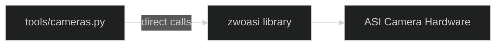
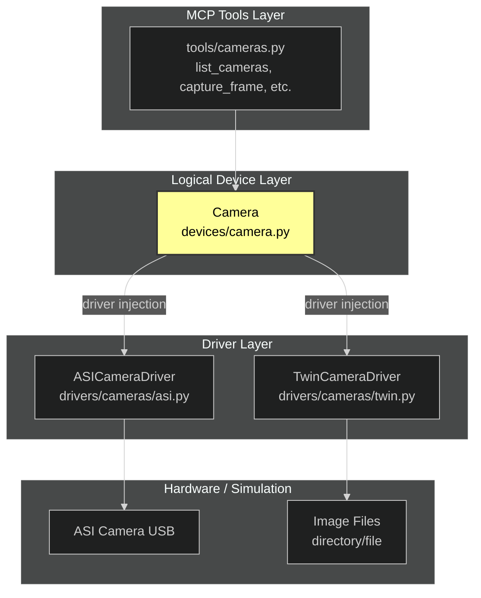
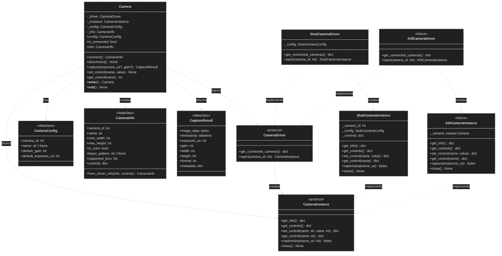
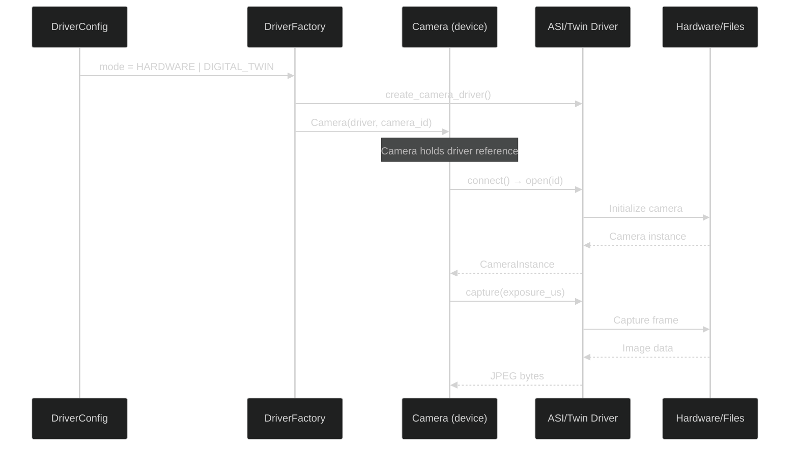

# Camera Architecture

## Overview

This document describes the camera subsystem architecture, explaining how MCP tools interact with camera hardware through abstraction layers.

## Current State vs Proposed

### Current State (Flat)



**Problem:** Tools call `zwoasi` directly. No abstraction, no way to inject a digital twin for testing.

### Proposed Architecture (Layered)



## Class Diagram



## Visibility Summary

| Class | Location | Visibility | Used By |
|-------|----------|------------|---------|
| `Camera` | `devices/camera.py` | **PUBLIC** | MCP tools, user code |
| `CameraConfig` | `devices/camera.py` | **PUBLIC** | User code (create cameras) |
| `CameraInfo` | `devices/camera.py` | **PUBLIC** | Returned by `connect()` |
| `CaptureResult` | `devices/camera.py` | **PUBLIC** | Returned by `capture()` |
| `CameraDriver` | `drivers/cameras/` | **PUBLIC** | Type hints, driver authors |
| `CameraInstance` | `drivers/cameras/` | **INTERNAL** | Only used by `Camera` class |
| `StubCameraDriver` | `drivers/cameras/stub.py` | **PUBLIC** | Factory, tests |
| `StubCameraInstance` | `drivers/cameras/stub.py` | **INTERNAL** | Only used by `StubCameraDriver` |

## Layer Responsibilities

### 1. MCP Tools Layer (`tools/cameras.py`)

**Purpose:** Expose camera functionality as MCP tools that AI agents can call.

**Responsibilities:**
- Define tool schemas (input/output)
- Convert between MCP types and domain types
- Handle errors and format responses
- Delegate to Camera device

**Does NOT:**
- Know about ASI SDK specifics
- Manage camera state directly
- Handle hardware communication

### 2. Logical Device Layer (`devices/camera.py`) ⭐ NEW

**Purpose:** Represent "what a camera is" independent of hardware.

**Responsibilities:**
- Maintain camera state (settings, connection status)
- Provide clean interface (capture, set_gain, get_info)
- Validate inputs (gain range, exposure limits)
- Log operations to active session
- Accept driver via dependency injection

**Does NOT:**
- Know which driver implementation is injected
- Handle raw SDK calls
- Format MCP responses

```python
class Camera:
    """Logical camera device with injected driver."""
    
    def __init__(self, driver: CameraDriver, camera_id: int):
        self._driver = driver
        self._camera_id = camera_id
        self._instance: CameraInstance | None = None
        self._settings = CameraSettings()
    
    def connect(self) -> None:
        """Connect to camera via driver."""
        self._instance = self._driver.open(self._camera_id)
    
    def capture(self, exposure_us: int | None = None) -> CaptureResult:
        """Capture a frame, return structured result."""
        # Use provided exposure or current setting
        exp = exposure_us or self._settings.exposure_us
        
        # Log to session
        get_session_manager().log("DEBUG", f"Capturing frame", 
            camera_id=self._camera_id, exposure_us=exp)
        
        # Delegate to driver
        jpeg_bytes = self._instance.capture(exp)
        
        return CaptureResult(
            image_data=jpeg_bytes,
            settings=self._settings.copy(),
            timestamp=datetime.now(timezone.utc),
        )
```

### 3. Driver Layer (`drivers/cameras/`)

**Purpose:** Implement hardware-specific communication.

**Two implementations:**

#### ASICameraDriver (`drivers/cameras/asi.py`)
- Wraps `zwoasi` library
- Handles ASI SDK initialization
- Maps control names to SDK constants
- Manages USB camera lifecycle

#### TwinCameraDriver (`drivers/cameras/twin.py`)
- Loads images from file/directory
- Simulates camera properties
- Mimics ASI control behavior
- No hardware dependency

**Both implement the same protocol:**

```python
class CameraDriver(Protocol):
    def get_connected_cameras(self) -> dict: ...
    def open(self, camera_id: int) -> CameraInstance: ...

class CameraInstance(Protocol):
    def get_info(self) -> dict: ...
    def get_controls(self) -> dict: ...
    def set_control(self, control: str, value: int) -> dict: ...
    def get_control(self, control: str) -> dict: ...
    def capture(self, exposure_us: int) -> bytes: ...
    def close(self) -> None: ...
```

## Directory Structure

```
src/telescope_mcp/
├── tools/
│   └── cameras.py          # MCP tool definitions
├── devices/                 # NEW: Logical device layer
│   ├── __init__.py
│   └── camera.py           # Camera class
└── drivers/
    └── cameras/
        ├── __init__.py     # Protocol definitions
        ├── asi.py          # Real ASI SDK driver
        └── twin.py         # Digital twin driver
```

## Dependency Injection Flow



## Configuration

```python
from telescope_mcp.drivers import DriverConfig, DriverMode, configure

# Use real hardware
configure(DriverConfig(mode=DriverMode.HARDWARE))

# Use digital twin with image directory
configure(DriverConfig(
    mode=DriverMode.DIGITAL_TWIN,
    twin_image_path=Path("/data/test-captures/"),
))
```

## Benefits of This Architecture

| Aspect | Benefit |
|--------|---------|
| **Testability** | Inject twin driver for unit tests |
| **Development** | Work without hardware connected |
| **Separation** | Tools don't know about ASI SDK |
| **Session logging** | Camera layer logs all operations |
| **Validation** | Camera layer validates inputs |
| **State management** | Camera tracks settings, connection |
| **Swappability** | Add new driver without changing tools |

## Migration Path

### Phase 1: Create Device Layer
1. Create `devices/camera.py` with `Camera` class
2. Create `drivers/cameras/asi.py` wrapping zwoasi
3. Rename `stub.py` → `twin.py`
4. Update `tools/cameras.py` to use `Camera`

### Phase 2: Enhance Twin
1. Add image file/directory support
2. Add simulated control responses
3. Add session logging integration

### Phase 3: Apply to Motors & Sensors
1. Create `devices/motor.py`
2. Create `devices/sensor.py`
3. Same pattern: device layer + driver injection

## Open Questions

1. **Should Camera be a singleton per camera_id?** 
   - Or create new instance per operation?
   
2. **Where does camera discovery happen?**
   - In tools layer? Device layer? Factory?

3. **How to handle hot-plug (camera connect/disconnect)?**
   - Event system? Polling? Ignore for now?
