# Camera Architecture

## Overview

This document describes the camera subsystem architecture, explaining how MCP tools interact with camera hardware through abstraction layers.

## Hardware Configuration

The telescope system uses two ZWO ASI cameras with different purposes:

### Camera 0: ASI120MC-S (Finder/Spotter Scope)

| Specification | Value | Notes |
|---------------|-------|-------|
| **Resolution** | 1280 × 960 (1.2 MP) | |
| **Pixel Size** | 3.75 µm | |
| **Sensor Size** | 4.8 × 3.6 mm | |
| **Bit Depth** | 8-bit | |
| **Lens** | 150° All-Sky | Fish-eye for wide field |
| **FOV per Pixel** | 421.875 arcseconds | 150° × 3600 / 1280 |
| **Purpose** | Plate solving, alignment | Wide field acquisition |

### Camera 1: ASI482MC (Main Imaging Camera)

| Specification | Value | Notes |
|---------------|-------|-------|
| **Resolution** | 1920 × 1080 (2.07 MP) | |
| **Pixel Size** | 5.8 µm | |
| **Sensor Size** | 11.13 × 6.26 mm | |
| **Bit Depth** | 12-bit | Higher dynamic range |
| **Optics** | 1600mm focal length | Through telescope |
| **FOV per Pixel** | 0.748 arcseconds | High resolution imaging |
| **FOV (total)** | 23.9' × 13.4' | Arcminutes |
| **Purpose** | Deep sky imaging | Primary science camera |

```mermaid
%%{init: {'theme': 'dark'}}%%
graph TB
    subgraph "Physical Setup"
        SKY[🌌 Sky]
        
        subgraph "Finder Scope"
            LENS[150° All-Sky Lens]
            ASI120[ASI120MC-S<br/>1280×960<br/>421.875 arcsec/px]
        end
        
        subgraph "Main Telescope"
            OTA[1600mm OTA]
            ASI482[ASI482MC<br/>1920×1080<br/>0.748 arcsec/px]
        end
    end
    
    SKY --> LENS
    SKY --> OTA
    LENS --> ASI120
    OTA --> ASI482
    
    style ASI120 fill:#9cf,stroke:#333,stroke-width:2px,color:#000
    style ASI482 fill:#f9c,stroke:#333,stroke-width:2px,color:#000
```



## Architecture Overview

### Previous State (Flat) — Replaced


**Problem:** Tools called `zwoasi` directly. No abstraction, no way to inject a digital twin for testing.

### Current Architecture (Layered) ✅ Implemented


## Class Diagrams

The camera subsystem is organized into three layers. Each diagram below focuses on one layer for clarity.

### Device Layer (Camera Class)

The main `Camera` class with its injectable dependencies and data types:


### Injectable Dependencies

Protocols that can be injected for testing and customization:


### Driver Implementations

Real hardware driver and digital twin for development:


> **Note:** `DigitalTwinCameraDriver.open()` returns a `CameraInstance` protocol implementation.
> The concrete `DigitalTwinCameraInstance` class is an internal implementation detail.

### CameraRegistry

Centralized camera discovery and singleton management:


## Visibility Summary

| Class | Location | Visibility | Used By |
|-------|----------|------------|---------|
| `Camera` | `devices/camera.py` | **PUBLIC** | MCP tools, user code |
| `CameraConfig` | `devices/camera.py` | **PUBLIC** | User code (create cameras) |
| `CaptureOptions` | `devices/camera.py` | **PUBLIC** | Passed to `capture()` |
| `CaptureResult` | `devices/camera.py` | **PUBLIC** | Returned by `capture()` |
| `StreamFrame` | `devices/camera.py` | **PUBLIC** | Yielded by `stream()` |
| `OverlayRenderer` | `devices/camera.py` | **PUBLIC** | Protocol for custom renderers |
| `RecoveryStrategy` | `devices/camera.py` | **PUBLIC** | Protocol for disconnect recovery |
| `Clock` | `devices/camera.py` | **PUBLIC** | Protocol for time injection |
| `CameraHooks` | `devices/camera.py` | **PUBLIC** | Event callbacks |
| `CameraRegistry` | `devices/registry.py` | **PUBLIC** | MCP tools, application startup |
| `CameraDriver` | `drivers/cameras/` | **PUBLIC** | Protocol for drivers |
| `CameraInstance` | `drivers/cameras/` | **PUBLIC** | Protocol returned by `open()` |
| `DigitalTwinCameraDriver` | `drivers/cameras/twin.py` | **PUBLIC** | Development, tests |
| `DigitalTwinConfig` | `drivers/cameras/twin.py` | **PUBLIC** | Configure twin behavior |
| `ImageSource` | `drivers/cameras/twin.py` | **PUBLIC** | Enum for twin image source |

## Layer Responsibilities

### 1. MCP Tools Layer (`tools/cameras.py`)

**Purpose:** Expose camera functionality as MCP tools that AI agents can call.

**Responsibilities:**
- Define tool schemas (input/output)
- Convert between MCP types and domain types
- Handle errors and format responses
- Delegate to Camera device

**Does NOT:**
- Know about ASI SDK specifics
- Manage camera state directly
- Handle hardware communication

### 2. Logical Device Layer (`devices/camera.py`) ⭐ NEW

**Purpose:** Represent "what a camera is" independent of hardware.

**Responsibilities:**
- Maintain camera state (settings, connection status)
- Provide clean interface (capture, set_gain, get_info)
- Validate inputs (gain range, exposure limits)
- Log operations to active session
- Accept driver via dependency injection

**Does NOT:**
- Know which driver implementation is injected
- Handle raw SDK calls
- Format MCP responses

```python
class Camera:
    """Logical camera device with injected driver."""
    
    def __init__(self, driver: CameraDriver, camera_id: int):
        self._driver = driver
        self._camera_id = camera_id
        self._instance: CameraInstance | None = None
        self._settings = CameraSettings()
    
    def connect(self) -> None:
        """Connect to camera via driver."""
        self._instance = self._driver.open(self._camera_id)
    
    def capture(self, exposure_us: int | None = None) -> CaptureResult:
        """Capture a frame, return structured result."""
        # Use provided exposure or current setting
        exp = exposure_us or self._settings.exposure_us
        
        # Log to session
        get_session_manager().log("DEBUG", f"Capturing frame", 
            camera_id=self._camera_id, exposure_us=exp)
        
        # Delegate to driver
        jpeg_bytes = self._instance.capture(exp)
        
        return CaptureResult(
            image_data=jpeg_bytes,
            settings=self._settings.copy(),
            timestamp=datetime.now(timezone.utc),
        )
```

### 3. Driver Layer (`drivers/cameras/`)

**Purpose:** Implement hardware-specific communication.

**Two implementations:**

#### ASICameraDriver (`drivers/cameras/asi.py`)
- Wraps `zwoasi` library
- Handles ASI SDK initialization
- Maps control names to SDK constants
- Manages USB camera lifecycle

#### TwinCameraDriver (`drivers/cameras/twin.py`)
- Loads images from file/directory
- Simulates camera properties
- Mimics ASI control behavior
- No hardware dependency

**Both implement the same protocol:**

```python
class CameraDriver(Protocol):
    def get_connected_cameras(self) -> dict: ...
    def open(self, camera_id: int) -> CameraInstance: ...

class CameraInstance(Protocol):
    def get_info(self) -> dict: ...
    def get_controls(self) -> dict: ...
    def set_control(self, control: str, value: int) -> dict: ...
    def get_control(self, control: str) -> dict: ...
    def capture(self, exposure_us: int) -> bytes: ...
    def close(self) -> None: ...
```

## Directory Structure

```
src/telescope_mcp/
├── tools/
│   └── cameras.py          # MCP tool definitions
├── devices/                 # Logical device layer
│   ├── __init__.py
│   ├── camera.py           # Camera class + protocols
│   ├── controller.py       # CameraController (multi-camera sync)
│   └── registry.py         # CameraRegistry (singleton management)
└── drivers/
    └── cameras/
        ├── __init__.py     # Protocol definitions
        ├── asi.py          # Real ASI SDK driver (future)
        └── twin.py         # Digital twin driver
```

## Dependency Injection Flow


## Configuration

```python
from telescope_mcp.drivers import DriverConfig, DriverMode, configure

# Use real hardware
configure(DriverConfig(mode=DriverMode.HARDWARE))

# Use digital twin with image directory
configure(DriverConfig(
    mode=DriverMode.DIGITAL_TWIN,
    twin_image_path=Path("/data/test-captures/"),
))
```

## Benefits of This Architecture

| Aspect | Benefit |
|--------|---------|
| **Testability** | Inject twin driver for unit tests |
| **Development** | Work without hardware connected |
| **Separation** | Tools don't know about ASI SDK |
| **Session logging** | Camera layer logs all operations |
| **Validation** | Camera layer validates inputs |
| **State management** | Camera tracks settings, connection |
| **Swappability** | Add new driver without changing tools |

## Observability Integration

Structured logging is integrated throughout the camera subsystem via the `telescope_mcp.observability` module.

### Logging Architecture


### Structured Logging Usage

```python
from telescope_mcp.observability import get_logger

logger = get_logger(__name__)

# Structured logging with keyword arguments
logger.info("Frame captured", 
    camera_id=0,
    exposure_us=100000,
    gain=50,
    size_bytes=len(data)
)

# Output (console): Frame captured camera_id=0 exposure_us=100000 gain=50 size_bytes=245760
# Output (JSON): {"timestamp": "...", "level": "INFO", "message": "Frame captured", "camera_id": 0, ...}
```

### Camera Statistics

```python
from telescope_mcp.observability import CameraStats

stats = CameraStats(camera_id=0)
stats.record_capture(duration_ms=150.5, size_bytes=245760)
stats.record_capture(duration_ms=148.2, size_bytes=245120)

summary = stats.get_summary()
# StatsSummary(
#     total_captures=2,
#     avg_duration_ms=149.35,
#     p95_duration_ms=150.5,
#     total_bytes=490880,
#     ...
# )
```

## Implementation Status

| Phase | Task | Status |
|-------|------|--------|
| **Phase 1** | Device Layer | ✅ Complete |
| | `devices/camera.py` with Camera class | ✅ |
| | `devices/registry.py` with CameraRegistry | ✅ |
| | `devices/controller.py` with CameraController | ✅ |
| | `drivers/cameras/twin.py` with accurate specs | ✅ |
| | `drivers/cameras/asi.py` ASI SDK wrapper | ✅ |
| **Phase 2** | Enhanced Digital Twin | ✅ Complete |
| | File/directory image sources | ✅ |
| | Simulated control responses | ✅ |
| | Real camera specs (ASI120MC-S, ASI482MC) | ✅ |
| **Phase 3** | Observability | ✅ Complete |
| | Structured logging module | ✅ |
| | Camera statistics collection | ✅ |
| | Integration across all layers | ✅ |
| **Phase 4** | Motors & Sensors | 🔲 Planned |
| | `devices/motor.py` | 🔲 |
| | `devices/sensor.py` | 🔲 |
| | Same pattern: device layer + driver injection | 🔲 |

## CameraController: Multi-Camera Coordination

### Purpose

Orchestrates synchronized captures across **two or more** cameras for alignment operations.

The controller manages a named collection of cameras and coordinates their capture timing. While the current telescope setup uses two cameras (finder + main), the architecture supports any number of cameras for future expansion (e.g., guide camera, spectrograph).

### Synchronized Capture Problem

For telescope alignment via plate solving, we need:
- **Spotterscope (finder):** Long exposure (e.g., 176 seconds) with wide field of view
- **Main camera:** Short exposure (e.g., 312 ms) through telescope optics

The short exposure must be **centered** within the long exposure so star positions match:

```
Finder (176s):  |=====================================|
                              ↑ midpoint (t=88s)
Main (312ms):               |===|
                            ↑ starts at t=87.844s
```

### Timing Calculation

```python
delay = (primary_exposure / 2) - (secondary_exposure / 2)

# Example: 176s primary, 312ms secondary
delay = (176_000_000 / 2) - (312_000 / 2)
      = 88_000_000 - 156_000
      = 87_844_000 µs (87.844 seconds)
```

### Class Diagram


### Usage Example

```python
from telescope_mcp.devices import (
    Camera, CameraConfig, CameraController, SyncCaptureConfig
)

# Create cameras
finder = Camera(driver, CameraConfig(camera_id=0, name="Finder"))
main = Camera(driver, CameraConfig(camera_id=1, name="Main"))

# Connect both
finder.connect()
main.connect()

# Create controller
controller = CameraController({
    "finder": finder,
    "main": main,
})

# Synchronized capture for alignment
result = controller.sync_capture(SyncCaptureConfig(
    primary="finder",
    secondary="main",
    primary_exposure_us=176_000_000,  # 176 seconds
    secondary_exposure_us=312_000,     # 312 ms
))

print(f"Timing error: {result.timing_error_ms:.1f}ms")

# Both frames now ready for plate solving
# result.primary_frame   -> finder image
# result.secondary_frame -> main image (centered in finder exposure)
```

### Testability

The `Clock` protocol allows injecting fake time for testing:

```python
class FakeClock:
    def __init__(self):
        self._time = 0.0
        self._sleeps = []
    
    def monotonic(self) -> float:
        return self._time
    
    def sleep(self, seconds: float) -> None:
        self._sleeps.append(seconds)
        self._time += seconds

# Test timing calculation without waiting
clock = FakeClock()
controller = CameraController(cameras, clock=clock)
result = controller.sync_capture(config)
assert clock._sleeps[0] == pytest.approx(87.844, rel=0.001)
```

## Design Decisions

### Camera Singleton Pattern ✅ DECIDED

**Decision:** Use **Singleton per camera_id** via `CameraRegistry` class.

**Rationale:**

| Factor | Why Singleton Wins |
|--------|-------------------|
| **Physical reality** | One camera = one USB connection = one object |
| **ASI SDK expectation** | `ASIOpenCamera` → use → `ASICloseCamera` lifecycle |
| **Connection cost** | ~300ms per connect; reuse is efficient |
| **CameraController** | Assumes persistent cameras for sync capture |
| **State consistency** | Settings (gain, exposure) stay synchronized |

**Implementation:**

```python
# Encapsulated in CameraRegistry class (devices/registry.py)
class CameraRegistry:
    def __init__(self, driver: CameraDriver):
        self._driver = driver
        self._cameras: dict[int, Camera] = {}
        self._discovery_cache: dict[int, CameraInfo] | None = None
    
    def get(self, camera_id: int) -> Camera:
        """Get or create a Camera singleton for this camera_id."""
        if camera_id not in self._cameras:
            config = CameraConfig(camera_id=camera_id)
            self._cameras[camera_id] = Camera(
                driver=self._driver,
                config=config,
                recovery=RecoveryStrategy(self),  # Inject recovery
            )
        return self._cameras[camera_id]
    
    def clear(self) -> None:
        """Disconnect all cameras and clear registry."""
        for camera in self._cameras.values():
            if camera.is_connected:
                camera.disconnect()
        self._cameras.clear()

# Usage with context manager
with CameraRegistry(driver) as registry:
    camera = registry.get(0)
    camera.connect()
    result = camera.capture()
# All cameras disconnected on exit
```

**Testing story:**

```python
# Tests bypass registry - create fresh instances directly
def test_capture():
    camera = Camera(mock_driver, config)  # Direct instantiation
    camera.connect()
    result = camera.capture()
    # No global state touched

# Integration tests use context manager
def test_with_registry():
    with CameraRegistry(mock_driver) as registry:
        camera = registry.get(0)
        # ... test ...
    # Automatic cleanup

# Or explicit cleanup in fixture
@pytest.fixture
def registry(mock_driver):
    reg = CameraRegistry(mock_driver)
    yield reg
    reg.clear()
```

### Camera Discovery in Device Layer ✅ DECIDED

**Decision:** Discovery happens in `CameraRegistry` class alongside singleton management.

**Rationale:**

| Factor | Why Device Layer Wins |
|--------|----------------------|
| **Centralized** | One class for all "where do I get cameras" questions |
| **Clean tools layer** | Tools just call `registry.discover()`, no driver knowledge |
| **Caching opportunity** | Can cache discovery results without changing tools |
| **Validation** | Can transform/validate driver output before returning |
| **Encapsulated state** | No module-level globals, all state in registry instance |

**Implementation:**

```python
# CameraRegistry.discover() in devices/registry.py
class CameraRegistry:
    def __init__(self, driver: CameraDriver):
        self._driver = driver
        self._discovery_cache: dict[int, CameraInfo] | None = None
    
    def discover(self, refresh: bool = False) -> dict[int, CameraInfo]:
        """Discover connected cameras with caching.
        
        Args:
            refresh: Force re-discovery (ignore cache)
        
        Returns:
            Dict mapping camera_id to CameraInfo
        """
        if self._discovery_cache is None or refresh:
            raw = self._driver.get_connected_cameras()
            self._discovery_cache = {
                cam_id: CameraInfo(**info) if isinstance(info, dict) else info
                for cam_id, info in raw.items()
            }
        return self._discovery_cache
```

**Usage from tools layer:**

```python
# tools/cameras.py
from telescope_mcp.devices import get_registry

@tool
def list_cameras() -> list[dict]:
    """List connected cameras."""
    registry = get_registry()
    cameras = registry.discover()
    return [asdict(info) for info in cameras.values()]

@tool  
def capture_frame(camera_id: int, exposure_us: int) -> dict:
    """Capture a frame from specified camera."""
    registry = get_registry()
    camera = registry.get(camera_id, auto_connect=True)
    return asdict(camera.capture(CaptureOptions(exposure_us=exposure_us)))
```

### Hot-Plug Handling: Lazy Re-validation ✅ DECIDED

**Decision:** Use **lazy re-validation** via injectable `RecoveryStrategy` — no polling, auto-recover on failure.

**Context:** Cameras don't typically come/go during operation, but if a USB cable gets bumped, we want recovery without restarting the MCP server.

**Rationale:**

| Factor | Why Lazy Re-validation Wins |
|--------|----------------------------|
| **No background threads** | Simple, no concurrency issues |
| **No polling overhead** | Don't waste cycles checking constantly |
| **Auto-recovery** | If camera comes back, next capture succeeds |
| **AI-agent friendly** | Retry semantics work naturally |
| **Singleton stays valid** | Camera object recovers in place |
| **Testable** | Inject mock RecoveryStrategy for testing |

**Implementation:**

```python
# RecoveryStrategy protocol (devices/camera.py)
class RecoveryStrategy(Protocol):
    def attempt_recovery(self, camera_id: int) -> bool:
        """Returns True if camera is available after recovery attempt."""
        ...

# Registry-based implementation (devices/registry.py)
class RegistryRecoveryStrategy:
    def __init__(self, registry: CameraRegistry):
        self._registry = registry
    
    def attempt_recovery(self, camera_id: int) -> bool:
        cameras = self._registry.discover(refresh=True)
        return camera_id in cameras

# Camera uses injected strategy (devices/camera.py)
class Camera:
    def __init__(self, ..., recovery: RecoveryStrategy | None = None):
        self._recovery = recovery or NullRecoveryStrategy()
    
    def _recover_and_capture(self, exposure_us: int, ...) -> CaptureResult:
        """Attempt to recover from camera disconnect."""
        self._instance = None
        
        # Use injected strategy (no circular import!)
        if not self._recovery.attempt_recovery(self._config.camera_id):
            raise CameraDisconnectedError(...)
        
        # Reconnect and retry
        self.connect()
        return self._instance.capture(exposure_us)
```

**Behavior:**

| Scenario | Result |
|----------|--------|
| Normal capture | Works as usual |
| Cable bumped, replugged | First capture fails, auto-recovers, retries |
| Camera unplugged permanently | `CameraDisconnectedError` after recovery attempt |
| AI agent retries failed capture | Second attempt succeeds if camera back |

**What this does NOT handle:**
- Proactive "camera available" notifications
- Hot-plug of *new* cameras (call `registry.discover(refresh=True)` manually)
- Registry cleanup of permanently removed cameras

### SOLID Improvements ✅ APPLIED

The following SOLID-principled improvements have been applied:

| # | Improvement | SOLID Principle | Benefit |
|---|-------------|-----------------|---------|
| 1 | `RecoveryStrategy` protocol | Dependency Inversion | No circular imports; testable recovery |
| 2 | `CameraRegistry` class | Single Responsibility | Encapsulated state; context manager support |
| 3 | Registry replaces `get_configured_driver()` | Dependency Inversion | Single point of configuration |
| 4 | Drivers can return `CameraInfo` | Type Safety | End-to-end type checking |
| 5 | Registry as context manager | Python Best Practice | Automatic cleanup |

## Open Questions

*All architectural questions have been resolved.*
