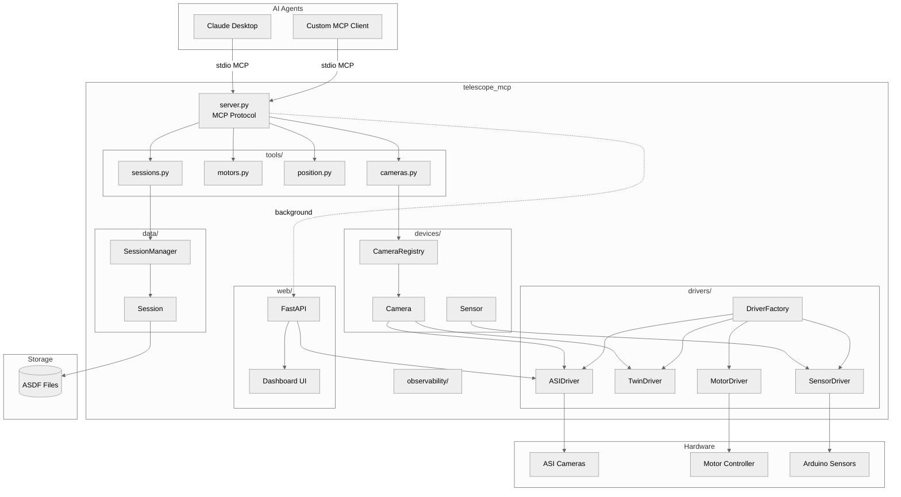
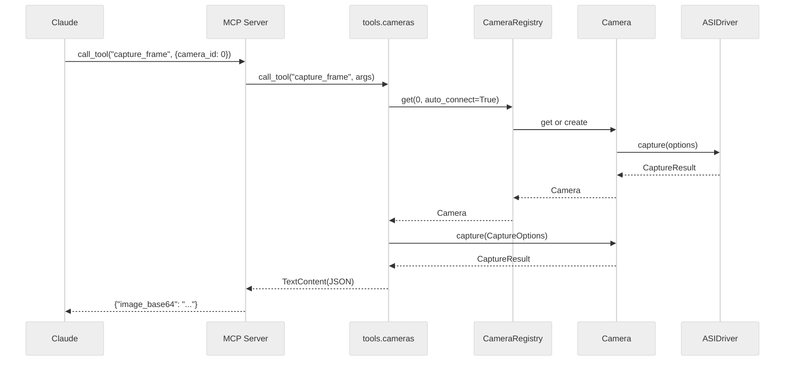

# telescope_mcp Architecture

> **AI Navigation**: Root package for AI-controlled telescope operations via Model Context Protocol.
> Entry via `telescope-mcp` CLI or `server.main()`. MCP tools at `tools.*`, web dashboard at `web.*`.

| Aspect | Details |
|--------|---------|
| **Purpose** | MCP server exposing telescope hardware (cameras, motors, sensors) to AI agents |
| **Stability** | ⚠️ **Active Development** - Core APIs stable; motor/position stubs pending |
| **Boundaries** | Standalone server; consumed by MCP clients (Claude Desktop, custom) |
| **Test Command** | `pdm run pytest -v` |

---

## 1. Overview

`telescope_mcp` is an MCP (Model Context Protocol) server that enables AI agents (Claude, GPT) to control telescope hardware through structured tool calls. The package provides:

1. **MCP Server** (`server.py`) - Protocol handler with camera/motor/session tools
2. **Web Dashboard** (`web/`) - Browser UI for human monitoring and manual control
3. **Device Layer** (`devices/`) - Hardware abstractions (Camera, Sensor)
4. **Driver Layer** (`drivers/`) - Hardware implementations (ASI, DigitalTwin)
5. **Tools Layer** (`tools/`) - MCP tool definitions for AI agents
6. **Data Layer** (`data/`) - Session management and ASDF storage

**Design Patterns**:
- **Dependency Injection**: Drivers injected into devices for testability
- **Protocol/Interface**: `@runtime_checkable` protocols for type safety
- **Factory Pattern**: Configurable driver creation via `DriverFactory`
- **Registry Pattern**: Camera discovery and lifecycle management

**Key Insight**: Two control paths—MCP (AI) and HTTP (human)—share the same device layer, enabling hybrid workflows.

---

## 2. Layout

```
telescope_mcp/
├── __init__.py              # Package version (0.1.0)
├── server.py                # MCP server entry point, CLI, dashboard orchestration
├── data/                    # Session management, ASDF storage
│   ├── session.py           # Session state machine
│   └── session_manager.py   # Singleton session lifecycle
├── devices/                 # Hardware abstractions
│   ├── camera.py            # Camera facade with DI
│   ├── camera_controller.py # Multi-camera orchestration
│   ├── camera_registry.py   # Discovery and lifecycle
│   └── sensor.py            # Environmental sensor facade
├── drivers/                 # Hardware implementations
│   ├── config.py            # DriverFactory, globals
│   ├── asi_sdk/             # ZWO ASI SDK wrapper
│   ├── cameras/             # Camera drivers (ASI, Twin)
│   ├── motors/              # Motor drivers (Serial, stub)
│   └── sensors/             # Sensor drivers (Arduino, Twin)
├── observability/           # Logging and metrics
│   ├── logging.py           # Structured JSON logging
│   └── stats.py             # Statistical aggregation
├── tools/                   # MCP tool definitions
│   ├── cameras.py           # 5 camera tools
│   ├── motors.py            # 5 motor tools (stubs)
│   ├── position.py          # 3 position tools (stubs)
│   └── sessions.py          # 7 session tools
├── utils/                   # Shared utilities
│   └── image.py             # ImageEncoder Protocol
└── web/                     # Web dashboard
    ├── app.py               # FastAPI application
    ├── templates/           # Jinja2 HTML
    └── static/              # CSS, JS assets
```

---

## 3. Public Surface

### 3.1 Entry Points (pyproject.toml)

| Command | Target | Description |
|---------|--------|-------------|
| `telescope-mcp` | `server:main` | MCP server over stdio |
| `telescope-web` | `web.app:main` | Standalone web dashboard |

### 3.2 server.py — Core Functions

| Symbol | Type | Stability | Description |
|--------|------|-----------|-------------|
| `main()` | `() -> None` | 🟢 Frozen | CLI entry point |
| `create_server(mode)` | `(str) -> Server` | 🟢 Frozen | MCP server factory |
| `run_server(...)` | `async` | 🟢 Frozen | Server lifecycle |
| `start_dashboard(...)` | `() -> None` | 🟢 Frozen | Background web server |
| `stop_dashboard()` | `() -> None` | 🟢 Frozen | Graceful shutdown |
| `parse_args()` | `() -> Namespace` | 🟡 Internal | CLI argument parsing |

### 3.3 CLI Arguments

| Argument | Type | Default | Description |
|----------|------|---------|-------------|
| `--mode` | str | `digital_twin` | `hardware` or `digital_twin` |
| `--dashboard-host` | str | None | Dashboard bind address |
| `--dashboard-port` | int | None | Dashboard port |
| `--dashboard-log-level` | str | `warning` | Uvicorn log level |
| `--data-dir` | str | None | ASDF session storage path |
| `--latitude` | float | None | Observer latitude (-90 to 90) |
| `--longitude` | float | None | Observer longitude (-180 to 180) |
| `--height` | float | 0.0 | Observer altitude (meters) |

### 3.4 Subpackage Summaries

| Package | Entry Point | Key Exports |
|---------|-------------|-------------|
| `data` | `SessionManager` | `Session`, `SessionType`, `LogLevel` |
| `devices` | `init_registry()` | `Camera`, `CameraRegistry`, `Sensor` |
| `drivers` | `get_factory()` | `DriverFactory`, ASI/Twin drivers |
| `observability` | `get_logger()` | `configure_logging`, `StatsAggregator` |
| `tools` | `*.register(server)` | Camera, motor, position, session tools |
| `utils` | — | `ImageEncoder`, `CV2ImageEncoder` |
| `web` | `create_app()` | FastAPI dashboard |

---

## 4. Dependencies

### 4.1 Subpackage Dependency Graph

```
server.py
├── tools.{cameras,motors,position,sessions}
│   ├── devices (CameraRegistry)
│   ├── data (SessionManager)
│   └── observability (get_logger)
├── web.app (create_app)
│   ├── drivers.asi_sdk
│   └── utils.image
├── drivers.config (get_factory)
└── observability (configure_logging)

devices/
├── drivers.cameras (ASIDriver, TwinDriver)
└── drivers.config (DriverFactory)

data/
└── observability (get_logger)
```

### 4.2 External Dependencies

| Package | Purpose | Version |
|---------|---------|---------|
| `mcp` | Model Context Protocol SDK | ≥1.0.0 |
| `fastapi` | Web framework | ≥0.115.0 |
| `uvicorn` | ASGI server | ≥0.30 |
| `numpy` | Array operations | ≥2.2.6 |
| `zwoasi` | ASI camera SDK | ≥0.2.0 |
| `asdf` | Session data format | ≥3.0.0 |
| `opencv-python-headless` | Image encoding | ≥4.12.0 |

### 4.3 I/O Boundaries

| Type | Interface | Used By |
|------|-----------|---------|
| stdio | MCP protocol | AI agents |
| HTTP | REST + MJPEG | Web dashboard |
| USB | Camera SDK | devices/drivers |
| Serial | Motor controller | drivers/motors |
| Filesystem | ASDF files | data/session_manager |

---

## 5. Invariants & Contracts

### 5.1 Server Lifecycle

| Invariant | Enforcement |
|-----------|-------------|
| Camera registry initialized before tools | `create_server()` calls `init_registry()` |
| Dashboard cleanup on shutdown | `run_server()` finally block |
| Registry shutdown on exit | `shutdown_registry()` in finally |
| Coordinate validation | `main()` validates lat/lon ranges |

### 5.2 Mode Selection

```python
# Modes determine driver selection
mode == "hardware"     → ASIDriver (real cameras)
mode == "digital_twin" → TwinDriver (simulation)
```

### 5.3 Dashboard State

| State | Thread-Safe | Notes |
|-------|-------------|-------|
| `_dashboard.thread` | ✅ | Daemon thread |
| `_dashboard.server` | ✅ | Uvicorn instance |
| `start_dashboard()` | ✅ | No-op if running |
| `stop_dashboard()` | ✅ | No-op if stopped |

---

## 6. Usage Examples

### 6.1 MCP Client Configuration (Claude Desktop)

```json
{
  "mcpServers": {
    "telescope": {
      "command": "pdm",
      "args": ["run", "telescope-mcp", "--mode", "digital_twin"],
      "cwd": "/path/to/telescope-mcp"
    }
  }
}
```

### 6.2 With Web Dashboard

```bash
pdm run telescope-mcp \
  --dashboard-host 0.0.0.0 \
  --dashboard-port 8080 \
  --mode hardware \
  --data-dir /data/telescope
```

### 6.3 With Observer Location

```bash
pdm run telescope-mcp \
  --latitude 40.7128 \
  --longitude -74.0060 \
  --height 10.0 \
  --mode digital_twin
```

### 6.4 Programmatic Usage

```python
import asyncio
from telescope_mcp.server import create_server, run_server

# Create server instance
server = create_server(mode="digital_twin")

# Run with dashboard
asyncio.run(run_server(
    dashboard_host="127.0.0.1",
    dashboard_port=8080,
    mode="digital_twin"
))
```

### 6.5 Testing

```bash
# Full test suite
pdm run pytest -v

# With coverage
pdm run pytest --cov=src/telescope_mcp --cov-report=html

# Specific module
pdm run pytest tests/test_server_coverage.py -v
```

---

## 7. AI Accessibility Map

### 7.1 Quick Reference

| Task | Target | Guards | Change Impact |
|------|--------|--------|---------------|
| Add MCP tool | `tools/*.py` | Add to TOOLS + register | Low |
| Add CLI arg | `server.py:parse_args` | None | Low |
| Change mode logic | `server.py:create_server` | Tests | Medium |
| Add device type | `devices/` | Protocol + tests | Medium |
| Add driver | `drivers/*/` | Config factory | Medium |
| Change session format | `data/session.py` | ASDF compat | **High** |

### 7.2 Architecture README Locations

| Package | README |
|---------|--------|
| `data/` | [data/README.md](data/README.md) |
| `devices/` | [devices/README.md](devices/README.md) |
| `drivers/` | [drivers/README.md](drivers/README.md) |
| `drivers/cameras/` | [drivers/cameras/README.md](drivers/cameras/README.md) |
| `drivers/sensors/` | [drivers/sensors/README.md](drivers/sensors/README.md) |
| `observability/` | [observability/README.md](observability/README.md) |
| `tools/` | [tools/README.md](tools/README.md) |
| `utils/` | [utils/README.md](utils/README.md) |
| `web/` | [web/README.md](web/README.md) |

### 7.3 Test Files by Module

| Module | Test File(s) |
|--------|--------------|
| `server.py` | `test_server_coverage.py`, `test_server_comprehensive.py` |
| `data/` | `test_sessions.py`, `test_sessions_extended.py` |
| `devices/` | `test_devices_exports.py`, `test_devices_extended.py` |
| `drivers/config` | `test_config_comprehensive.py` |
| `tools/` | `test_tools*.py` |
| `web/` | `test_web_app.py` |

---

## 8. Architecture Diagram



### Control Flow: AI Tool Call



---

## 9. Coverage Status

| Module | Stmts | Miss | Branch | Cover |
|--------|-------|------|--------|-------|
| `__init__.py` | 1 | 0 | 0 | **100%** |
| `server.py` | 100 | 0 | 16 | **100%** |
| `data/*` | 204 | 0 | 48 | **100%** |
| `devices/*` | 718 | 0 | 158 | **100%** |
| `drivers/*` | 998 | 33 | 200 | 97% |
| `observability/*` | 267 | 0 | 68 | **100%** |
| `tools/*` | 231 | 0 | 36 | **100%** |
| `utils/*` | 30 | 0 | 6 | **100%** |
| `web/*` | 151 | 0 | 22 | **100%** |
| **TOTAL** | 2895 | 33 | 554 | **99%** |

---

## 10. Implementation Status

| Component | Status | Notes |
|-----------|--------|-------|
| MCP Server | ✅ Complete | stdio protocol |
| Camera tools | ✅ Complete | 5 tools |
| Session tools | ✅ Complete | 7 tools |
| Motor tools | ⏳ Stubs | Pending hardware driver |
| Position tools | ⏳ Stubs | Pending encoder driver |
| Web dashboard | ✅ Complete | MJPEG streams, controls |
| ASI camera driver | ✅ Complete | Real hardware |
| Digital twin driver | ✅ Complete | Simulation |
| Arduino sensor driver | ✅ Complete | Serial protocol |
| Motor serial driver | 🔄 Partial | 82% coverage |
| ASDF session storage | ✅ Complete | Persistent data |
| Structured logging | ✅ Complete | JSON + context |
