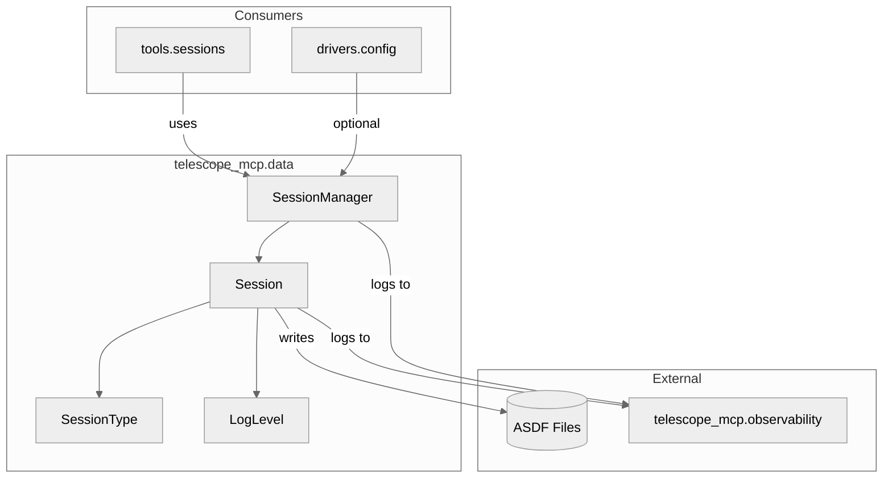
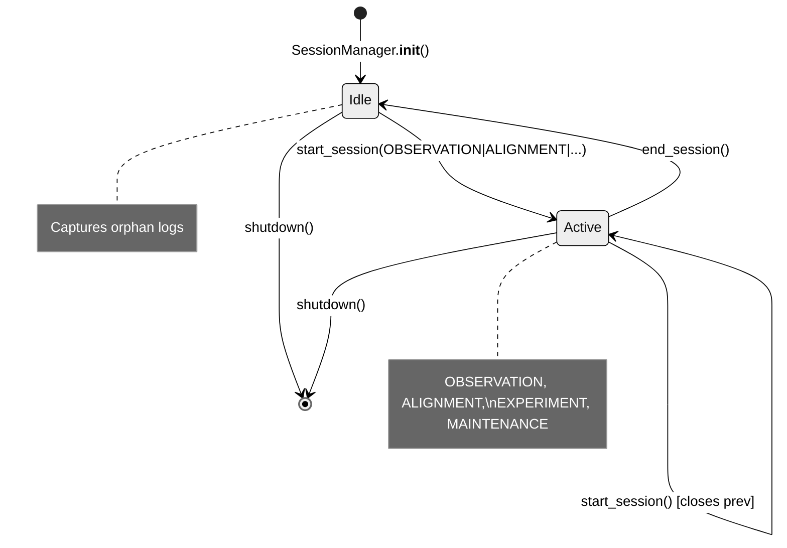
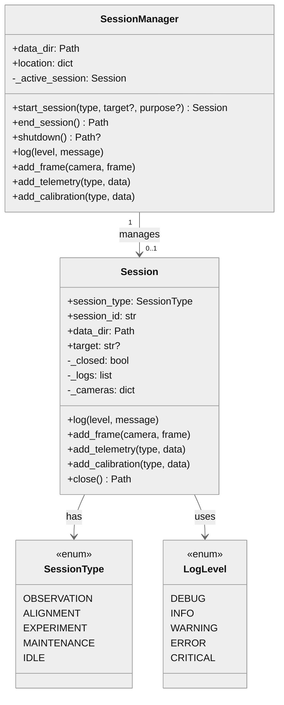

# telescope_mcp.data

## 1. Component Overview

| Field | Value |
|-------|-------|
| **Name** | `telescope_mcp.data` |
| **Type** | Package |
| **Responsibility** | Session-based telescope data storage using ASDF format |
| **Boundaries** | Internal to telescope_mcp; used by tools/, drivers/ |
| **Entry Points** | `SessionManager` (facade), `Session` (direct access) |
| **State** | Stateful — in-memory buffers until ASDF write |
| **Pattern** | "Always have a session" — idle captures orphan logs |

**Key Decisions:**
- ASDF as single source of truth (provenance, numpy arrays, metadata)
- Date-organized output: `data_dir/YYYY/MM/DD/{session_id}.asdf`
- Dual-write logging: console + ASDF buffer

**Risks:** Large frame arrays in memory before flush

**Owners:** telescope_mcp team

---

## 2. Code Layout

```
data/
├── __init__.py          # Re-exports: SessionManager, Session, SessionType, LogLevel
├── session.py           # Core Session class, enums, ASDF serialization
├── session_manager.py   # Facade with auto-idle lifecycle management
└── README.md            # This file
```

---

## 3. Public Surface (⚠️ DO NOT MODIFY w/o approval)

### Enums 🔒frozen

```python
class SessionType(str, Enum):
    OBSERVATION = "observation"
    ALIGNMENT = "alignment"
    EXPERIMENT = "experiment"
    MAINTENANCE = "maintenance"
    IDLE = "idle"

class LogLevel(str, Enum):
    DEBUG = "DEBUG"
    INFO = "INFO"
    WARNING = "WARNING"
    ERROR = "ERROR"
    CRITICAL = "CRITICAL"
```

### Constants 🔒frozen

```python
MAX_TARGET_SLUG_LENGTH = 20  # Filename safety
```

### Session 🔒frozen

```python
class Session:
    def __init__(
        self,
        session_type: SessionType,
        data_dir: Path,
        *,
        target: str | None = None,
        purpose: str | None = None,
        location: dict[str, float] | None = None,
        auto_rotate: bool = False,           # Reserved for SessionManager
        rotate_interval_hours: int = 1,      # Reserved for SessionManager
    ) -> None: ...

    # Data collection
    def log(self, level: LogLevel | str, message: str, source: str = "telescope_mcp", **context: Any) -> None: ...
    def add_event(self, event: str, **details: Any) -> None: ...
    def add_frame(self, camera: str, frame: NDArray[np.uint8 | np.uint16], *, camera_info: dict | None = None, settings: dict | None = None) -> None: ...
    def add_telemetry(self, telemetry_type: str, **data: Any) -> None: ...
    def add_calibration(self, calibration_type: str, data: Any) -> None: ...

    # Lifecycle
    def close(self) -> Path: ...  # Writes ASDF, returns path

    # Properties
    @property
    def is_closed(self) -> bool: ...
    @property
    def duration_seconds(self) -> float: ...
    @property
    def session_id(self) -> str: ...  # '{type}_{target?}_{YYYYMMDD_HHMMSS}'
```

### SessionManager 🔒frozen

```python
class SessionManager:
    def __init__(
        self,
        data_dir: Path | str,
        *,
        location: dict[str, float] | None = None,
        auto_rotate_idle: bool = True,
        idle_rotate_hours: int = 1,
    ) -> None: ...

    # Session lifecycle
    def start_session(self, session_type: SessionType | str, *, target: str | None = None, purpose: str | None = None, location: dict | None = None) -> Session: ...
    def end_session(self) -> Path: ...
    def shutdown(self) -> Path | None: ...

    # Data collection (delegates to active session)
    def log(self, level: LogLevel | str, message: str, source: str = "telescope_mcp", **context: Any) -> None: ...
    def add_event(self, event: str, **details: Any) -> None: ...
    def add_frame(self, camera: str, frame: NDArray, *, camera_info: dict | None = None, settings: dict | None = None) -> None: ...
    def add_telemetry(self, telemetry_type: str, **data: Any) -> None: ...
    def add_calibration(self, calibration_type: str, data: Any) -> None: ...

    # Properties
    @property
    def active_session(self) -> Session | None: ...
    @property
    def active_session_type(self) -> SessionType | None: ...
    @property
    def active_session_id(self) -> str | None: ...
```

### Change Impact

| Symbol | Breaking If Changed |
|--------|---------------------|
| `SessionType` enum values | ASDF files, MCP tools, UI |
| `LogLevel` enum values | Log parsing, monitoring |
| `Session.close()` return type | All callers expecting Path |
| `SessionManager.end_session()` | MCP session tools |
| ASDF tree structure | All downstream analysis |

### Data Contracts

**Inputs:**
- `data_dir: Path` — writable directory
- `frame: NDArray[uint8|uint16]` — image data
- `location: {lat: float, lon: float, alt: float}` — observer position

**Outputs:**
- ASDF file at `data_dir/YYYY/MM/DD/{session_id}.asdf`
- Tree structure: `{meta, cameras, telemetry, calibration, observability}`

---

## 4. Dependencies

### depends_on

| Module | Purpose |
|--------|---------|
| `asdf` | ASDF file serialization |
| `numpy` | Frame arrays, telemetry data |
| `telescope_mcp.observability` | `get_logger()` for console output |

### required_by

| Module | Usage |
|--------|-------|
| `telescope_mcp.tools.sessions` | MCP tool handlers |
| `telescope_mcp.drivers.config` | Optional SessionManager injection |

### IO

| Type | Details |
|------|---------|
| fs | Write ASDF to `data_dir/YYYY/MM/DD/*.asdf` |
| console | Dual-write logs via `telescope_mcp.observability` |

---

## 5. Invariants & Errors (⚠️ MUST PRESERVE)

### Invariants

| Invariant | Threshold |
|-----------|-----------|
| SessionManager always has session | `_active_session is not None` (except after `shutdown()`) |
| Session immutable after close | `_closed = True` blocks all `add_*` |
| ASDF tree has required keys | `meta`, `cameras`, `telemetry`, `calibration`, `observability` |
| Session ID format | `{type}_{target?}_{YYYYMMDD_HHMMSS}` |

### Verification

```bash
pdm run pytest tests/test_data_session.py tests/test_data_session_manager.py --cov=telescope_mcp.data --cov-branch -q
```

### Constraints

| Type | Constraint |
|------|------------|
| Memory | Frames buffered until `close()` — large sessions need RAM |
| Concurrency | Not thread-safe — single-writer assumed |
| Performance | `close()` is I/O-bound (ASDF write) |

### Side Effects

| Method | Side Effect |
|--------|-------------|
| `Session.__init__` | Logs "Session started" to console |
| `Session.log()` | Dual-write to console |
| `Session.close()` | Creates directories, writes ASDF file |
| `SessionManager.__init__` | Creates `data_dir`, starts idle session |
| `SessionManager.start_session()` | Closes previous session (writes ASDF) |

### Errors

| Exception | When Raised |
|-----------|-------------|
| `RuntimeError("Cannot log to a closed session")` | `add_*` on closed Session |
| `RuntimeError("Cannot add event to a closed session")` | `add_event` on closed |
| `RuntimeError("Cannot add frame to a closed session")` | `add_frame` on closed |
| `RuntimeError("Cannot add telemetry to a closed session")` | `add_telemetry` on closed |
| `RuntimeError("Cannot add calibration to a closed session")` | `add_calibration` on closed |
| `RuntimeError("Session already closed")` | `close()` called twice |
| `RuntimeError("No active session to end")` | `end_session()` after `shutdown()` |
| `ValueError` | Invalid `SessionType` string |

---

## 6. Usage

### Setup

```python
from pathlib import Path
from telescope_mcp.data import SessionManager, SessionType, LogLevel

sessions = SessionManager(data_dir=Path("/data/telescope"))
```

### Observation Workflow

```python
# Start observation (closes idle session automatically)
sessions.start_session(SessionType.OBSERVATION, target="M31")

# Capture data
sessions.log(LogLevel.INFO, "Exposure started")
sessions.add_frame("main", frame_array, settings={"gain": 200})
sessions.add_telemetry("mount_position", ra=10.68, dec=41.27)

# End observation → writes ASDF, returns to idle
asdf_path = sessions.end_session()
```

### Direct Session Access

```python
from telescope_mcp.data import Session, SessionType

session = Session(SessionType.ALIGNMENT, Path("/data"), purpose="Polar alignment")
session.log(LogLevel.INFO, "Starting alignment")
session.add_calibration("plate_solve_results", {"ra": 12.5, "dec": 45.2})
path = session.close()
```

### Config

| Source | Keys |
|--------|------|
| Constructor args | `data_dir`, `location`, `auto_rotate_idle`, `idle_rotate_hours` |

### Testing

```bash
# Run tests with coverage
pdm run pytest tests/test_data_session.py tests/test_data_session_manager.py --cov=telescope_mcp.data --cov-branch

# Current: 79 tests, 100% coverage (204 stmts, 48 branches)
```

### Pitfalls

| Issue | Fix |
|-------|-----|
| `isinstance(LogLevel.INFO, str)` returns True | Use `not isinstance(x, LogLevel)` for type checks |
| Module-level coverage fails with ASDF | Use `--cov=telescope_mcp.data` (package) |
| Forgot to call `close()` | Use `SessionManager` — auto-closes on `start_session`/`shutdown` |

---

## 7. AI-Accessibility Map (⚠️ CRITICAL)

| Task | Target | Guards | Change Impact |
|------|--------|--------|---------------|
| Add new session type | `SessionType` enum in [session.py](session.py#L23-L29) | 🔒 ABI-frozen, update all switch statements | MCP tools, ASDF parsing |
| Add new log level | `LogLevel` enum in [session.py](session.py#L32-L39) | 🔒 ABI-frozen | Log parsing, monitoring |
| Modify ASDF tree structure | `_build_asdf_tree()` in [session.py](session.py#L317-L346) | Update tests, downstream parsers | All ASDF consumers |
| Add telemetry type | `_telemetry` dict in [session.py](session.py#L116-L120) | None — extensible | None |
| Add calibration type | `_calibration` dict in [session.py](session.py#L121-L125) | None — extensible | None |
| Change session ID format | `_generate_session_id()` in [session.py](session.py#L142-L156) | Breaks filename expectations | File lookup, UI |
| Add SessionManager method | [session_manager.py](session_manager.py) | Mirror to Session if applicable | None |
| Change auto-idle behavior | `_ensure_idle_session()` in [session_manager.py](session_manager.py#L99-L109) | Invariant: always have session | Orphan log loss |

---

## 8. Mermaid

### Package Boundaries



### Session Lifecycle



### Class Relationships


