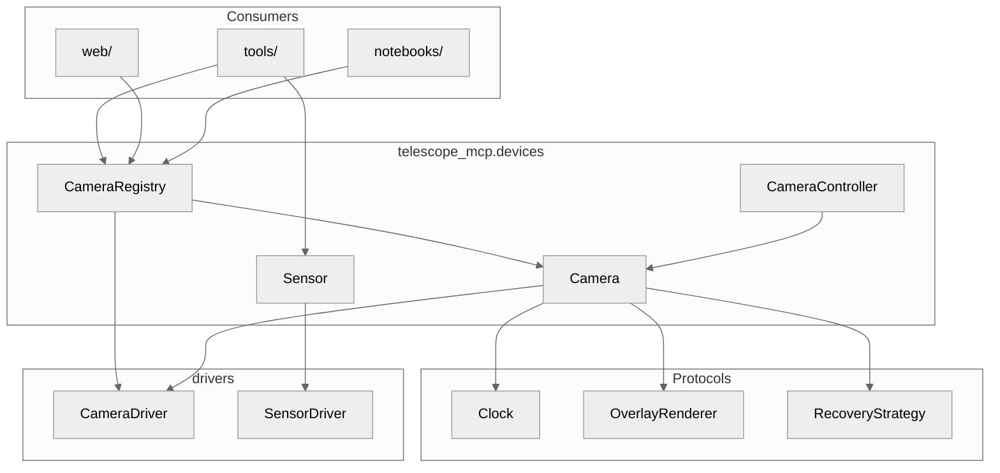
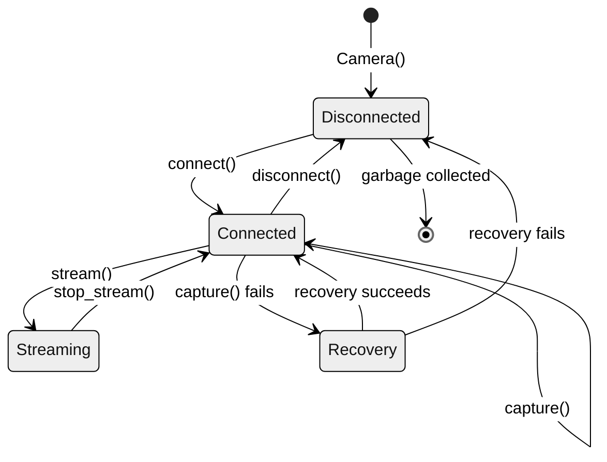
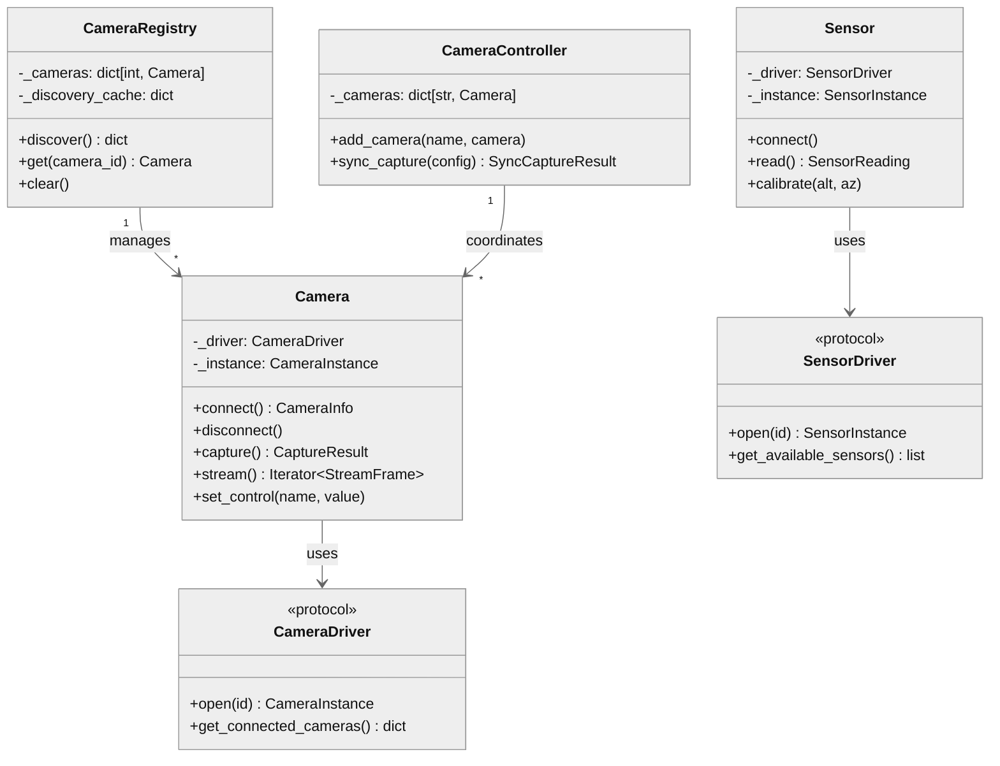
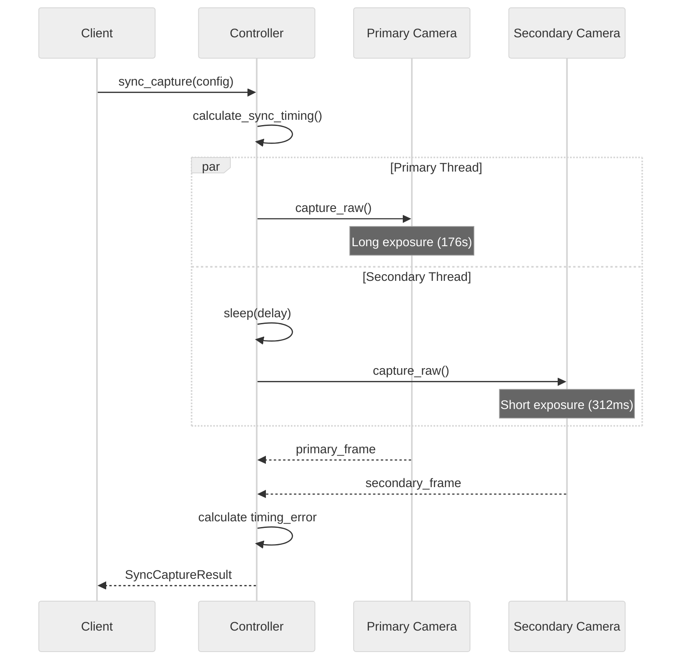

# telescope_mcp.devices

## 1. Component Overview

| Field | Value |
|-------|-------|
| **Name** | `telescope_mcp.devices` |
| **Type** | Package |
| **Responsibility** | Hardware-agnostic device abstractions with driver injection |
| **Boundaries** | Consumes drivers/, consumed by tools/, web/, notebooks |
| **Entry Points** | `Camera`, `CameraRegistry`, `CameraController`, `Sensor` |
| **State** | Stateful — connection state, settings, telemetry cached in instances |
| **Pattern** | Dependency Injection, Strategy (overlays, recovery), Singleton (registry) |

**Key Decisions:**
- Driver injection for testability (real ASI vs DigitalTwin)
- Protocol-based dependencies (Clock, OverlayRenderer, RecoveryStrategy)
- Registry singleton pattern for module-level convenience
- "Always connected" guarantee via CameraRegistry lifecycle

**Risks:** USB camera exclusivity (one process at a time), memory for frame buffering

**Owners:** telescope_mcp team

---

## 2. Code Layout

```
devices/
├── __init__.py           # Re-exports 30 symbols from submodules
├── camera.py             # Camera class, protocols, config/result dataclasses (2092 lines)
├── camera_controller.py  # Multi-camera sync capture coordination
├── camera_registry.py    # Discovery, singleton management, module-level convenience
├── sensor.py             # Telescope orientation sensor abstraction
└── README.md             # This file
```

---

## 3. Public Surface (⚠️ DO NOT MODIFY w/o approval)

### Protocols 🔒frozen

```python
@runtime_checkable
class Clock(Protocol):
    def monotonic(self) -> float: ...
    def sleep(self, seconds: float) -> None: ...

@runtime_checkable
class OverlayRenderer(Protocol):
    def render(self, image_data: bytes, config: OverlayConfig, camera_info: CameraInfo | None) -> bytes: ...

@runtime_checkable
class RecoveryStrategy(Protocol):
    def attempt_recovery(self, camera_id: int) -> bool: ...
```

### Camera 🔒frozen

```python
class Camera:
    def __init__(self, driver: CameraDriver, config: CameraConfig, renderer: OverlayRenderer | None = None, clock: Clock | None = None, hooks: CameraHooks | None = None, recovery: RecoveryStrategy | None = None, stats: CameraStats | None = None) -> None: ...

    # Lifecycle
    def connect(self) -> CameraInfo: ...
    def disconnect(self) -> None: ...

    # Capture
    def capture(self, options: CaptureOptions | None = None) -> CaptureResult: ...
    def capture_raw(self, exposure_us: int | None = None, gain: int | None = None) -> CaptureResult: ...
    def stream(self, options: CaptureOptions | None = None, max_fps: float = 30.0) -> Iterator[StreamFrame]: ...
    def stop_stream(self) -> None: ...

    # Controls
    def set_control(self, name: str, value: int) -> None: ...
    def get_control(self, name: str) -> int: ...
    def set_overlay(self, config: OverlayConfig | None) -> None: ...

    # Properties
    @property
    def config(self) -> CameraConfig: ...
    @property
    def is_connected(self) -> bool: ...
    @property
    def info(self) -> CameraInfo | None: ...
    @property
    def overlay(self) -> OverlayConfig | None: ...
    @property
    def is_streaming(self) -> bool: ...
```

### CameraRegistry 🔒frozen

```python
class CameraRegistry:
    def __init__(self, driver: CameraDriver, renderer: OverlayRenderer | None = None, clock: Clock | None = None, hooks: CameraHooks | None = None) -> None: ...

    # Discovery
    def discover(self, refresh: bool = False) -> dict[int, CameraInfo]: ...

    # Singleton access
    def get(self, camera_id: int, name: str | None = None, auto_connect: bool = False) -> Camera: ...
    def has(self, camera_id: int) -> bool: ...
    def remove(self, camera_id: int) -> Camera | None: ...
    def clear(self) -> None: ...

    # Properties
    @property
    def driver(self) -> CameraDriver: ...
    @property
    def camera_ids(self) -> list[int]: ...
    @property
    def discovered_ids(self) -> list[int]: ...

# Module-level convenience
def init_registry(driver: CameraDriver, ...) -> CameraRegistry: ...
def get_registry() -> CameraRegistry: ...
def shutdown_registry() -> None: ...
```

### CameraController 🔒frozen

```python
class CameraController:
    def __init__(self, cameras: dict[str, Camera] | None = None, clock: Clock | None = None) -> None: ...

    def add_camera(self, name: str, camera: Camera, *, overwrite: bool = False) -> None: ...
    def remove_camera(self, name: str) -> Camera | None: ...
    def get_camera(self, name: str) -> Camera: ...
    def calculate_sync_timing(self, primary_exposure_us: int, secondary_exposure_us: int) -> int: ...
    def sync_capture(self, config: SyncCaptureConfig) -> SyncCaptureResult: ...

    @property
    def camera_names(self) -> list[str]: ...
```

### Sensor 🔒frozen

```python
class Sensor:
    def __init__(self, driver: SensorDriver, config: SensorConfig | None = None) -> None: ...

    # Lifecycle
    def connect(self, sensor_id: int | str | None = None) -> None: ...
    def disconnect(self) -> None: ...

    # Operations
    def read(self) -> SensorReading: ...
    def calibrate(self, true_altitude: float, true_azimuth: float) -> None: ...
    def reset(self) -> None: ...
    def get_available_sensors(self) -> list[AvailableSensor]: ...
    def get_status(self) -> SensorDeviceStatus: ...

    # Properties
    @property
    def connected(self) -> bool: ...
    @property
    def info(self) -> DeviceSensorInfo | None: ...
    @property
    def last_reading(self) -> SensorReading | None: ...
    @property
    def statistics(self) -> SensorStatistics: ...
```

### Config/Result Dataclasses 🔒frozen

```python
@dataclass
class CameraConfig:
    camera_id: int
    name: str | None = None
    default_gain: int = 50
    default_exposure_us: int = 100_000

@dataclass
class CameraInfo:
    camera_id: int; name: str; max_width: int; max_height: int
    is_color: bool; bayer_pattern: str | None
    supported_bins: list[int]; controls: dict[str, ControlInfo]

@dataclass
class CaptureOptions:
    exposure_us: int | None = None; gain: int | None = None
    apply_overlay: bool = True; format: Literal["jpeg", "raw"] = "jpeg"

@dataclass
class CaptureResult:
    image_data: bytes; timestamp: datetime; exposure_us: int; gain: int
    width: int | None; height: int | None; format: str = "jpeg"
    metadata: dict[str, Any]; has_overlay: bool = False

@dataclass
class StreamFrame:
    image_data: bytes; timestamp: datetime; sequence_number: int
    exposure_us: int; gain: int; has_overlay: bool = False

@dataclass
class SyncCaptureConfig:
    primary: str; secondary: str
    primary_exposure_us: int; secondary_exposure_us: int
    primary_gain: int | None = None; secondary_gain: int | None = None

@dataclass
class SyncCaptureResult:
    primary_frame: CaptureResult; secondary_frame: CaptureResult
    timing_error_us: int
    @property
    def timing_error_ms(self) -> float: ...
```

### Exceptions 🔒frozen

```python
class CameraError(Exception): ...
class CameraNotConnectedError(CameraError): ...
class CameraAlreadyConnectedError(CameraError): ...
class CameraDisconnectedError(CameraError): ...
class CameraNotInRegistryError(Exception): ...
class CameraControllerError(Exception): ...
class CameraNotFoundError(CameraControllerError): ...
class SyncCaptureError(CameraControllerError): ...
```

### Change Impact

| Symbol | Breaking If Changed |
|--------|---------------------|
| `Camera.capture()` return type | All capture consumers, ASDF storage |
| `CameraInfo` fields | UI, MCP tools, status displays |
| `CaptureResult.metadata` keys | Analysis pipelines, logging |
| `init_registry()`/`get_registry()` | Server startup, all tools |
| `SyncCaptureResult.timing_error_ms` | Alignment quality assessment |

### Data Contracts

**Inputs:**
- `driver: CameraDriver` — must implement `open()`, `get_connected_cameras()`
- `frame: NDArray[uint8|uint16]` — from driver capture
- `exposure_us: int` — microseconds, 1–3,600,000,000

**Outputs:**
- `CaptureResult.image_data: bytes` — JPEG encoded
- `StreamFrame` via generator yield
- `SyncCaptureResult` with timing metrics

---

## 4. Dependencies

### depends_on

| Module | Purpose |
|--------|---------|
| `telescope_mcp.drivers.cameras` | CameraDriver protocol, ASI/DigitalTwin |
| `telescope_mcp.drivers.sensors` | SensorDriver protocol |
| `telescope_mcp.observability` | `get_logger()`, `CameraStats` |

### required_by

| Module | Usage |
|--------|-------|
| `telescope_mcp.tools` | MCP tool handlers |
| `telescope_mcp.web` | FastAPI endpoints, MJPEG streaming |
| `telescope_mcp.drivers.config` | Registry initialization |
| Notebooks | Interactive testing |

### IO

| Type | Details |
|------|---------|
| USB | Camera/sensor hardware via drivers |
| console | Structured logging via observability |

---

## 5. Invariants & Errors (⚠️ MUST PRESERVE)

### Invariants

| Invariant | Enforcement |
|-----------|-------------|
| Camera singleton per ID in registry | `CameraRegistry.get()` returns cached instance |
| Camera operations require connection | `CameraNotConnectedError` on `capture()`/`stream()` |
| Overlay never applied to `capture_raw()` | `apply_overlay=False` forced |
| Stream single-threaded per Camera | `_streaming` flag prevents concurrent streams |
| Module registry requires init | `RuntimeError` from `get_registry()` if not initialized |

### Verification

```bash
pdm run pytest tests/test_camera_edge_cases.py tests/test_devices_exports.py -v
```

### Constraints

| Type | Constraint |
|------|------------|
| Memory | Frame data in memory until returned (JPEG ~1-5MB each) |
| Concurrency | Not thread-safe; use external sync for multi-threaded access |
| USB | Only one process can connect to camera at a time |

### Side Effects

| Method | Side Effect |
|--------|-------------|
| `Camera.connect()` | Opens USB device, applies default settings |
| `Camera.disconnect()` | Releases USB handle |
| `Camera.capture()` | Hardware exposure, stats recording |
| `CameraRegistry.discover()` | USB bus enumeration |
| `init_registry()` | Sets module-level global |
| `shutdown_registry()` | Disconnects all cameras, clears global |

### Errors

| Exception | When Raised |
|-----------|-------------|
| `CameraNotConnectedError` | `capture()`, `stream()`, `set_control()`, `get_control()` before `connect()` |
| `CameraAlreadyConnectedError` | `connect()` when already connected |
| `CameraDisconnectedError` | USB disconnect during capture + recovery failed |
| `CameraError` | Driver errors, control failures |
| `CameraNotInRegistryError` | `registry.get(id)` for unknown camera_id |
| `CameraNotFoundError` | `controller.get_camera(name)` for unknown name |
| `SyncCaptureError` | Sync capture failure (check `.camera_role`, `.original_error`) |
| `RuntimeError` | `get_registry()` before `init_registry()` |

---

## 6. Usage

### Basic Camera

```python
from telescope_mcp.devices import Camera, CameraConfig
from telescope_mcp.drivers.cameras import DigitalTwinCameraDriver

driver = DigitalTwinCameraDriver()
config = CameraConfig(camera_id=0, name="Main")

with Camera(driver, config) as cam:
    result = cam.capture()
    print(f"Captured {len(result.image_data)} bytes")
```

### Registry Pattern

```python
from telescope_mcp.devices import CameraRegistry

with CameraRegistry(driver) as registry:
    cameras = registry.discover()
    camera = registry.get(0, auto_connect=True)
    result = camera.capture()
# All cameras disconnected on exit
```

### Module-Level Singleton

```python
from telescope_mcp.devices import init_registry, get_registry, shutdown_registry

# At startup
init_registry(driver)

# Anywhere in application
registry = get_registry()
camera = registry.get(0)

# At shutdown
shutdown_registry()
```

### Synchronized Capture

```python
from telescope_mcp.devices import CameraController, SyncCaptureConfig

controller = CameraController({"finder": finder_cam, "main": main_cam})
result = controller.sync_capture(SyncCaptureConfig(
    primary="finder", secondary="main",
    primary_exposure_us=176_000_000,  # 176s
    secondary_exposure_us=312_000,     # 312ms
))
print(f"Timing error: {result.timing_error_ms:.1f}ms")
```

### Sensor

```python
from telescope_mcp.devices import Sensor
from telescope_mcp.drivers.sensors import DigitalTwinSensorDriver

with Sensor(DigitalTwinSensorDriver()) as sensor:
    reading = sensor.read()
    print(f"Alt: {reading.altitude:.1f}°, Az: {reading.azimuth:.1f}°")
```

### Testing

```bash
# Run device tests
pdm run pytest tests/test_camera_edge_cases.py tests/test_devices_exports.py -v

# ~501 camera/sensor related tests across test suite
```

### Pitfalls

| Issue | Fix |
|-------|-----|
| USB "device busy" | Call `disconnect()` / `shutdown_registry()` before exit |
| `RuntimeError: Registry not initialized` | Call `init_registry()` at app startup |
| Stream not stopping | Call `stop_stream()` before breaking loop |
| Concurrent stream corruption | One stream per Camera instance |

---

## 7. AI-Accessibility Map (⚠️ CRITICAL)

| Task | Target | Guards | Change Impact |
|------|--------|--------|---------------|
| Add new capture option | `CaptureOptions` in [camera.py](camera.py#L331-L346) | Update `capture()` to use it | Consumers must update |
| Add camera control | `set_control()`/`get_control()` in [camera.py](camera.py#L1539-L1609) | Validate control name exists | Driver must support |
| Add overlay type | `OverlayConfig.overlay_type` in [camera.py](camera.py#L305-L329) | Create OverlayRenderer impl | Renderer must handle |
| Add recovery strategy | Implement `RecoveryStrategy` protocol in [camera.py](camera.py#L243-L283) | Return bool from `attempt_recovery()` | None if protocol compliant |
| Add sensor capability | `DeviceSensorInfo` in [sensor.py](sensor.py#L103-L126) | Update `connect()` to populate | UI may need update |
| Modify sync timing | `calculate_sync_timing()` in [camera_controller.py](camera_controller.py#L257-L291) | Ensure delay ≥ 0 | Alignment accuracy |
| Add registry hook | `CameraHooks` in [camera.py](camera.py#L495-L527) | Follow callback protocol | None |
| Change module-level API | [camera_registry.py](camera_registry.py#L648-L866) | Update all `get_registry()` callers | Server startup, tools |

---

## 8. Mermaid

### Package Boundaries



### Camera Lifecycle



### Class Relationships



### Sync Capture Timeline


