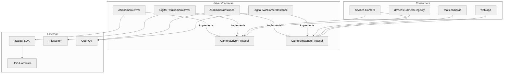
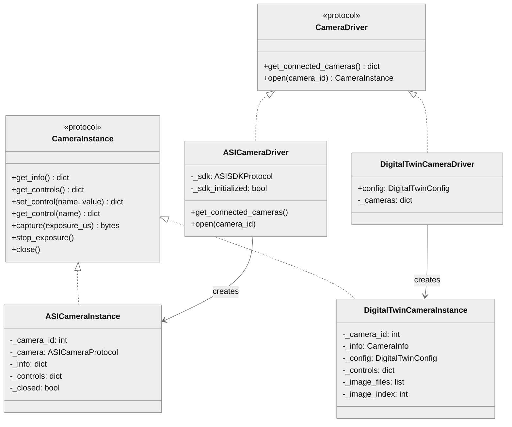

# Camera Drivers Architecture

## 1. Component Overview

| Field | Value |
|-------|-------|
| **Classification** | `telescope_mcp.drivers.cameras` · package · camera hardware abstraction |
| **Boundaries** | Consumed by `devices.Camera`, `tools.cameras`, `web.app` |
| **Public Surface** | 2 Protocols, 4 Classes, 3 TypedDicts, 2 Factories |
| **Patterns** | Protocol-based DI, Digital Twin, Factory |
| **Tech** | Python 3.13+ · zwoasi · opencv-python · numpy |
| **Entry Points** | `ASICameraDriver`, `DigitalTwinCameraDriver` |
| **State** | Stateful (camera connections, control values) |
| **Owners** | @telescope-mcp-maintainers |

**Decisions:** Protocol abstraction for HW/sim swap · Lazy SDK init · Driver-level JPEG encoding

**Risks:** USB exclusive lock blocks processes · Long exposures block thread · SDK version coupling

**Constraints:**
- **Perf:** Capture latency = exposure + ~100ms encode · 10-30fps streaming viable
- **Concurrency:** Single camera per process · No thread-safe capture
- **Security:** USB device permissions required · No credential handling

## 2. Code Layout

```
cameras/
├── __init__.py          # Protocols + re-exports
├── asi.py               # Real ZWO ASI hardware driver (1033 lines)
├── twin.py              # Digital twin simulation (1087 lines)
└── README.md            # This file
```

## 3. Public Surface (⚠️ DO NOT MODIFY w/o approval)

### Key Naming Conventions

| Context | Format | Example | Notes |
|---------|--------|---------|-------|
| Control names (API) | PascalCase | `"Gain"`, `"Exposure"` | Used in `set_control()`/`get_control()` |
| ASI get_info() output | snake_case | `camera_id`, `max_width` | Normalized from SDK |
| Twin TwinCameraInfo | PascalCase | `MaxWidth`, `MaxHeight` | Matches raw ASI SDK format |
| ControlInfo keys | PascalCase | `MinValue`, `MaxValue` | Matches ASI SDK control structure |

**Note:** The digital twin's `TwinCameraInfo` uses PascalCase keys to match raw ASI SDK output for simulation fidelity. The `ASICameraInstance.get_info()` normalizes these to snake_case for cleaner Python APIs. Control names use PascalCase without the `ASI_` prefix (e.g., `"Gain"` not `"ASI_GAIN"`).

### 🔒 Protocols (ABI-frozen)

```python
@runtime_checkable
class CameraDriver(Protocol):
    def get_connected_cameras(self) -> dict[int, dict[str, Any]]: ...
    def open(self, camera_id: int) -> CameraInstance: ...

@runtime_checkable
class CameraInstance(Protocol):
    def get_info(self) -> dict[str, Any]: ...
    def get_controls(self) -> dict[str, dict[str, Any]]: ...
    def set_control(self, control: str, value: int) -> dict[str, Any]: ...
    def get_control(self, control: str) -> dict[str, Any]: ...
    def capture(self, exposure_us: int) -> bytes: ...  # Returns JPEG
    def stop_exposure(self) -> None: ...
    def close(self) -> None: ...
    def __enter__(self) -> CameraInstance: ...
    def __exit__(...) -> None: ...
```

### 🔒 ASI Implementation

```python
class ASICameraDriver:
    def __init__(self, sdk: ASISDKProtocol | None = None) -> None
    def get_connected_cameras(self) -> dict[int, DiscoveredCamera]
    def open(self, camera_id: int) -> CameraInstance

class ASICameraInstance:
    def __init__(self, camera_id: int, camera: ASICameraProtocol) -> None
    def get_info(self) -> dict[str, Any]
    def get_controls(self) -> dict[str, dict[str, Any]]
    def set_control(self, control: str, value: int) -> dict[str, Any]
    def get_control(self, control: str) -> dict[str, Any]
    def capture(self, exposure_us: int, image_type: int|None=None, jpeg_quality: int=90) -> bytes
    def stop_exposure(self) -> None
    def close(self) -> None
```

### 🔒 Digital Twin Implementation

```python
class DigitalTwinCameraDriver:
    def __init__(self, config: DigitalTwinConfig|None=None, cameras: Mapping[int,CameraInfo]|None=None)
    def get_connected_cameras(self) -> dict[int, CameraInfo]
    def open(self, camera_id: int) -> DigitalTwinCameraInstance

class DigitalTwinCameraInstance:
    def __init__(self, camera_id: int, info: CameraInfo, config: DigitalTwinConfig)
    # Same interface as ASICameraInstance

class ImageSource(Enum):
    SYNTHETIC = "synthetic"  # Test patterns
    DIRECTORY = "directory"  # Cycle through folder
    FILE = "file"           # Single image

@dataclass
class DigitalTwinConfig:
    image_source: ImageSource = ImageSource.SYNTHETIC
    image_path: Path | None = None
    cycle_images: bool = True
```

### 🔒 TypedDicts

```python
class CameraInfo(TypedDict, total=False):
    camera_id: int; name: str; max_width: int; max_height: int
    pixel_size_um: float; is_color: bool; bit_depth: int
    is_usb3: bool; has_cooler: bool; has_st4_port: bool

class ControlInfo(TypedDict):
    min_value: int; max_value: int; default_value: int
    is_auto_supported: bool; is_writable: bool; description: str

class ControlValue(TypedDict):
    control: str; value: int; auto: bool
```

### 🔒 Factory Functions

```python
def create_file_camera(image_path: Path|str) -> DigitalTwinCameraDriver
def create_directory_camera(image_dir: Path|str, cycle: bool=True) -> DigitalTwinCameraDriver
```

### 🔒 Constants

```python
CONTROL_MAP: Mapping[str, int]  # "Gain" -> asi.ASI_GAIN, etc.
DEFAULT_CAMERAS: Mapping[int, CameraInfo]  # 0: ASI120MC-S, 1: ASI482MC
```

### ⚠️ Change Impact

| Change | Breaks |
|--------|--------|
| Modify `CameraDriver` protocol | All driver implementations, `devices.Camera`, tools |
| Modify `CameraInstance` protocol | All instance implementations, streaming, capture flows |
| Change `capture()` return type | Web streaming, MCP tools, file saving |
| Rename controls in `CONTROL_MAP` | All control set/get operations |

### Data Contracts

**Inputs:**
- `camera_id: int` ≥ 0 (from discovery)
- `exposure_us: int` 1–3,600,000,000
- `control: str` from `CONTROL_MAP` keys
- `value: int` within control min/max

**Outputs:**
- `capture() -> bytes` JPEG-encoded, camera resolution
- `get_info() -> dict` matches `CameraInfo` structure
- `get_control() -> dict` matches `ControlValue` structure

## 4. Dependencies

### depends_on
| Dependency | Purpose |
|------------|---------|
| `zwoasi` | ASI SDK Python bindings |
| `cv2` (opencv-python) | JPEG encoding, image resize |
| `numpy` | Image array manipulation |
| `telescope_mcp.drivers.asi_sdk` | SDK library path resolution |
| `telescope_mcp.observability` | Structured logging |

### required_by
| Consumer | Usage |
|----------|-------|
| `devices.Camera` | High-level camera abstraction |
| `devices.CameraRegistry` | Camera discovery |
| `tools.cameras` | MCP tool handlers |
| `web.app` | MJPEG streaming endpoint |

### IO Boundaries
| Type | Details |
|------|---------|
| USB | Exclusive camera device access (ASI) |
| FS | Image file read (twin FILE/DIRECTORY mode) |
| Memory | Image buffers (width × height × channels) |

## 5. Invariants & Errors (⚠️ MUST PRESERVE)

### Invariants

| Invariant | Threshold |
|-----------|-----------|
| Exposure range | 1µs – 3,600,000,000µs (1 hour) |
| JPEG quality | 0–100 |
| camera_id | ≥ 0 |
| Control names | Must exist in `CONTROL_MAP` |

### Verification

```bash
pdm run pytest tests/drivers/cameras/ -v --cov=src/telescope_mcp/drivers/cameras
```

### Errors

| Error | When Raised |
|-------|-------------|
| `ValueError("exposure_us must be >= 1")` | exposure < 1µs |
| `ValueError("exposure_us must be <= 3600000000")` | exposure > 1hr |
| `ValueError("jpeg_quality must be 0-100")` | quality out of range |
| `ValueError("camera_id must be >= 0")` | negative camera_id |
| `ValueError("Unknown control: X")` | invalid control name |
| `ValueError("Camera X not found")` | twin: invalid camera_id |
| `RuntimeError("ASI SDK initialization failed")` | SDK load failure |
| `RuntimeError("Cannot open ASI camera X")` | camera open failure |
| `RuntimeError("Exposure failed with status: X")` | hardware capture error |
| `RuntimeError("Exposure timeout")` | capture exceeded timeout |
| `RuntimeError("Failed to encode image as JPEG")` | cv2.imencode failure |

### Side Effects

| Operation | Side Effect |
|-----------|-------------|
| `ASICameraDriver()` | None (lazy init) |
| `get_connected_cameras()` | USB enumeration, brief camera opens |
| `open()` | Exclusive USB device lock |
| `capture()` | Blocking I/O for exposure duration |
| `close()` | USB device release |

## 6. Usage

### Basic Capture

```python
from telescope_mcp.drivers.cameras import ASICameraDriver

driver = ASICameraDriver()
cameras = driver.get_connected_cameras()
with driver.open(0) as cam:
    jpeg = cam.capture(100_000)  # 100ms
```

### Digital Twin Testing

```python
from telescope_mcp.drivers.cameras import DigitalTwinCameraDriver, create_directory_camera

# Synthetic patterns
driver = DigitalTwinCameraDriver()

# Cycle through images
driver = create_directory_camera("/data/sky_frames/", cycle=True)
```

### Control Operations

```python
cam.set_control("Gain", 100)
cam.set_control("Exposure", 5_000_000)  # 5s
result = cam.get_control("Gain")  # {"control": "Gain", "value": 100, "auto": False}
```

### Config / ENV

| Setting | Location | Default |
|---------|----------|---------|
| SDK library | Auto-detected via `asi_sdk.get_sdk_library_path()` | Architecture-specific |

### Testing

```bash
# Unit tests (mocked SDK)
pdm run pytest tests/drivers/cameras/test_asi.py -v

# Digital twin tests
pdm run pytest tests/drivers/cameras/test_twin.py -v

# Protocol compliance tests
pdm run pytest tests/test_protocol_compliance.py::TestCameraProtocolCompliance -v

# Coverage
pdm run pytest tests/drivers/cameras/ --cov=src/telescope_mcp/drivers/cameras --cov-report=term-missing
```

### Protocol Conformance Testing

All implementations **must** pass protocol compliance tests in `tests/test_protocol_compliance.py`:

```python
from tests.helpers import assert_implements_protocol
from telescope_mcp.drivers.cameras import CameraDriver, CameraInstance

# Driver protocol compliance
driver = DigitalTwinCameraDriver()
assert_implements_protocol(driver, CameraDriver)

# Instance protocol compliance
instance = driver.open(0)
assert_implements_protocol(instance, CameraInstance)
```

The `assert_implements_protocol()` helper uses `@runtime_checkable` isinstance() checks to verify:
- All protocol methods are implemented
- Method signatures are compatible
- Missing methods raise `AssertionError` with details

**Test Coverage:**

| Class | Protocol | Test |
|-------|----------|------|
| `DigitalTwinCameraDriver` | `CameraDriver` | `test_digital_twin_camera_driver_implements_protocol` |
| `DigitalTwinCameraInstance` | `CameraInstance` | `test_digital_twin_camera_instance_implements_protocol` |
| `ASICameraDriver` | `CameraDriver` | `test_asi_camera_driver_implements_protocol` |
| `ASICameraInstance` | `CameraInstance` | `test_asi_camera_instance_implements_protocol` |

**Adding New Implementations:**

When creating a new camera driver/instance, add protocol compliance tests:

```python
class TestCameraProtocolCompliance:
    def test_my_new_driver_implements_protocol(self) -> None:
        from telescope_mcp.drivers.cameras import CameraDriver
        driver = MyNewCameraDriver()
        assert_implements_protocol(driver, CameraDriver)

    def test_my_new_instance_implements_protocol(self) -> None:
        from telescope_mcp.drivers.cameras import CameraInstance
        driver = MyNewCameraDriver()
        instance = driver.open(0)
        try:
            assert_implements_protocol(instance, CameraInstance)
        finally:
            instance.close()
```

### Pitfalls

| Issue | Fix |
|-------|-----|
| Camera locked after crash | Unplug/replug USB or reboot |
| "SDK initialization failed" | Install ASI SDK, check `LD_LIBRARY_PATH` |
| Long exposure blocks thread | Use async wrapper or thread pool |
| Twin returns wrong resolution | Check `CameraInfo.MaxWidth/MaxHeight` |

## 7. AI-Accessibility Map (⚠️ CRITICAL)

| Task | Target | Guards | Change Impact |
|------|--------|--------|---------------|
| Add new control | `asi.py:CONTROL_MAP` | Immutable dict | All control operations |
| Change exposure limits | `asi.py:_MIN/MAX_EXPOSURE_US` | Validation in `capture()` | Capture calls |
| Add image source mode | `twin.py:ImageSource` | Enum | Twin capture routing |
| Modify camera info fields | `asi.py:CameraInfo`, `twin.py:CameraInfo` | TypedDict | Info consumers |
| Add capture format | `asi.py:capture()` | `image_type` param | JPEG encoding path |
| Mock SDK for tests | `ASICameraDriver(sdk=mock)` | `ASISDKProtocol` | None (DI pattern) |
| Add new twin camera | `twin.py:DEFAULT_CAMERAS` | Immutable dict | Discovery results |

## 8. Diagrams (optional)

### Component Boundaries



### Class Relationships


