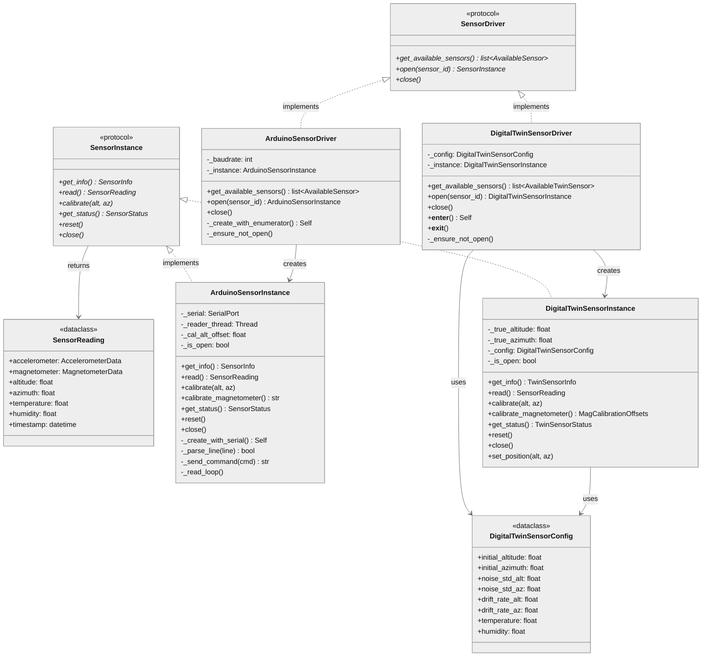
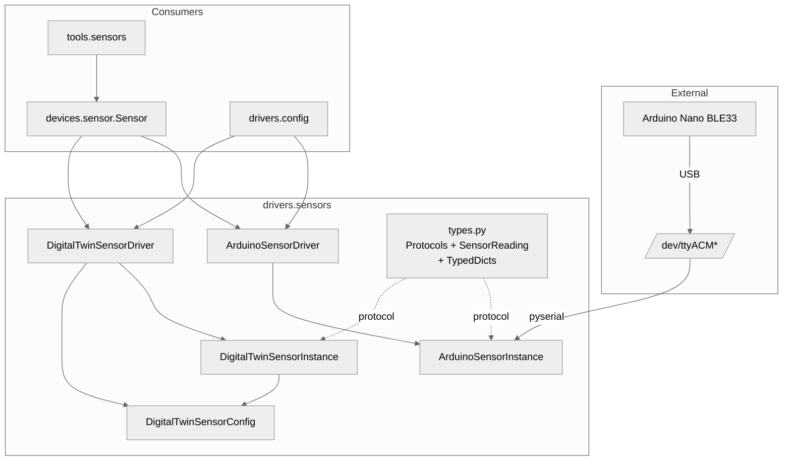

# Sensor Drivers Architecture

## 1. Component Overview

| Attribute | Value |
|-----------|-------|
| **Name** | `drivers.sensors` |
| **Type** | Package |
| **Responsibility** | Telescope orientation sensing via IMU (accelerometer/magnetometer) |
| **Context** | Hardware abstraction layer for position feedback |
| **Public Surface** | `SensorReading`, `SensorInstance`, `SensorDriver`, `validate_position`, `ArduinoSensorDriver`, `ArduinoSensorInstance`, `DigitalTwinSensorDriver`, `DigitalTwinSensorInstance`, `DigitalTwinSensorConfig`, `SerialPort`, `PortEnumerator` |
| **Patterns** | Protocol-based DI, Factory (Driver→Instance), Digital Twin, Context Manager |
| **Language** | Python 3.13+ |
| **Stack** | pyserial, threading, dataclasses, TypedDict |
| **Entry Points** | `ArduinoSensorDriver.open()`, `DigitalTwinSensorDriver.open()` |
| **State** | Stateful (calibration, position cache, serial connection) |
| **Test Coverage** | 100% (arduino.py: 250 stmts/64 branches, twin.py: 164 stmts/12 branches) |

### Key Decisions
- **Protocol-based abstraction**: `SensorInstance`/`SensorDriver` use Python `Protocol` with `...` (ellipsis) bodies = structural typing, implementations must provide all methods
- **Background reader thread**: Arduino instance uses daemon thread for continuous ~10Hz data
- **Offset calibration model**: `calibrated = scale * raw + offset` for position correction
- **TypedDict returns**: All dict-returning methods use TypedDict for static type checking
- **`# pragma: no cover`**: Protocol classes and hardware-only code excluded from coverage

### Protocol Pattern
```python
class SensorInstance(Protocol):  # pragma: no cover
    def read(self) -> SensorReading:
        ...  # Abstract - implementations MUST override
```
The `...` (ellipsis) marks abstract methods. `# pragma: no cover` excludes from coverage since protocol methods are never executed directly.

### Risks
- Serial port contention (only one process can own port)
- Thread safety: reader thread writes state, main thread reads
- Calibration drift over time without periodic recalibration

## 2. Code Layout

```
drivers/sensors/
├── __init__.py          # Public exports, re-exports SerialPort/PortEnumerator (68 lines)
├── types.py             # 🔒 SensorReading dataclass, SensorInstance/SensorDriver protocols, TypedDicts (425 lines)
├── arduino.py           # ArduinoSensorInstance/Driver - real hardware via serial (1284 lines)
└── twin.py              # DigitalTwinSensorInstance/Driver/Config - simulation for testing (795 lines)
```

**Test Files:**
```
tests/drivers/sensors/
├── test_arduino.py      # 113 tests for Arduino driver (3975 lines)
└── test_twin.py         # 25 tests for Digital Twin driver (691 lines)
```

## 3. Public Surface

### 🔒 Frozen (ABI stable)

| Symbol | Signature | Stability | Change Impact |
|--------|-----------|-----------|---------------|
| `SensorReading` | `@dataclass(accelerometer, magnetometer, altitude, azimuth, temperature, humidity, timestamp, raw_values)` | 🔒 | Breaks all sensor consumers |
| `SensorInstance` | `Protocol: get_info(), read(), calibrate(), get_status(), reset(), close()` | 🔒 | Breaks device layer |
| `SensorDriver` | `Protocol: get_available_sensors(), open(), close()` | 🔒 | Breaks config/factory |
| `AccelerometerData` | `TypedDict(aX, aY, aZ)` | 🔒 | Breaks SensorReading consumers |
| `MagnetometerData` | `TypedDict(mX, mY, mZ)` | 🔒 | Breaks SensorReading consumers |
| `SensorInfo` | `TypedDict(type, name, port, firmware, capabilities)` | 🔒 | Breaks get_info() consumers |
| `SensorStatus` | `TypedDict(connected, calibrated, is_open, error, ...)` | 🔒 | Breaks get_status() consumers |
| `AvailableSensor` | `TypedDict(id, type, name, port, description)` | 🔒 | Breaks get_available_sensors() consumers |

### ⚠️ Internal (may change)

| Symbol | Signature | Notes |
|--------|-----------|-------|
| `ArduinoSensorInstance._create_with_serial()` | `classmethod(serial_port, port_name, start_reader) -> Self` | Testing factory |
| `ArduinoSensorDriver._create_with_enumerator()` | `classmethod(port_enumerator, serial_factory, baudrate) -> Self` | Testing factory |
| `ArduinoSensorInstance._parse_line()` | `(line: str) -> bool` | Parse serial data |
| `ArduinoSensorInstance._send_command()` | `(cmd, wait, timeout) -> str` | Serial command |
| `ArduinoSensorInstance.calibrate_magnetometer()` | `() -> str` | Mag calibration |
| `ArduinoSensorInstance._set_tilt_calibration()` | `(slope, intercept) -> None` | Tilt correction |
| `ArduinoSensorInstance._stop_output()` | `() -> None` | Pause streaming |
| `ArduinoSensorInstance._start_output()` | `() -> None` | Resume streaming |
| `DigitalTwinSensorInstance.set_position()` | `(altitude, azimuth) -> None` | Test control |
| `DigitalTwinSensorInstance.calibrate_magnetometer()` | `() -> MagCalibrationOffsets` | Simulated mag cal |
| `DigitalTwinSensorConfig` | `@dataclass(initial_altitude, initial_azimuth, noise_std_*, drift_rate_*, ...)` | Twin configuration |
| `TwinSensorInfo` | `TypedDict` | Twin-specific info |
| `TwinSensorStatus` | `TypedDict` | Twin-specific status |
| `MagCalibrationOffsets` | `TypedDict(offset_x, offset_y, offset_z)` | Mag cal return type |

### Data Contracts

**Input (calibrate)**:
```python
true_altitude: float  # 0-90 degrees
true_azimuth: float   # 0-360 degrees
```

**Output (read)**:
```python
SensorReading(
    accelerometer={'aX': float, 'aY': float, 'aZ': float},  # g units
    magnetometer={'mX': float, 'mY': float, 'mZ': float},   # µT
    altitude=float,      # 0-90° calibrated
    azimuth=float,       # 0-360° calibrated
    temperature=float,   # Celsius
    humidity=float,      # %RH
    timestamp=datetime,  # UTC
    raw_values=str,      # Tab-separated Arduino format
)
```

**Output (calibrate_magnetometer - Twin)**:
```python
MagCalibrationOffsets(
    offset_x=float,  # µT
    offset_y=float,  # µT
    offset_z=float,  # µT
)
```

## 4. Dependencies

### depends_on
| Module | Purpose |
|--------|---------|
| `drivers.serial` | `SerialPort`, `PortEnumerator` protocols |
| `observability` | `get_logger()` structured logging |
| `pyserial` | Serial communication (runtime, optional for twin) |

### required_by
| Module | Purpose |
|--------|---------|
| `devices.sensor` | `Sensor` wrapper uses driver/instance |
| `drivers.config` | `create_sensor_driver()` factory |
| `tools.sensors` | MCP tool implementations |

### IO
- **Serial**: `/dev/ttyACM*` @ 115200 baud (Arduino)
- **Protocol**: Tab-separated values: `aX\taY\taZ\tmX\tmY\tmZ\ttemp\thumidity\r\n`
- **Commands**: `RESET`, `STATUS`, `CALIBRATE`, `STOP`, `START`

## 5. Invariants & Errors

### ⚠️ Must Preserve

| Invariant | Threshold | Verification |
|-----------|-----------|--------------|
| Altitude range | 0-90° | `assert 0 <= reading.altitude <= 90` |
| Azimuth range | 0-360° | `reading.azimuth % 360` normalization |
| Single instance per driver | 1 | `RuntimeError` if `open()` called twice |
| Background reader is daemon | Always | Thread exits with main program |
| Calibrate altitude validation | 0-90 | `ValueError` if outside range |
| Calibrate azimuth validation | 0-360 | `ValueError` if outside range |

### Errors

| Error | When Raised |
|-------|-------------|
| `RuntimeError("Sensor is closed")` | `read()` after `close()` |
| `RuntimeError("No sensor data available yet")` | `read()` before first data received |
| `RuntimeError("Sensor already open")` | `open()` without `close()` |
| `RuntimeError("pyserial not installed")` | Arduino used without pyserial |
| `RuntimeError("Sensor index N out of range")` | `open(int)` with invalid index |
| `ValueError("Altitude must be between 0 and 90 degrees, got N")` | `calibrate()` with bad altitude |
| `ValueError("Azimuth must be between 0 and 360 degrees, got N")` | `calibrate()` with bad azimuth |

### Side Effects
- **Serial port**: Exclusive lock during connection
- **Thread**: Daemon thread spawned on Arduino open
- **State**: Calibration offsets persist until `reset()`

### Concurrency
- Reader thread writes `_accelerometer`, `_magnetometer`, `_last_update`
- Main thread reads cached values (eventual consistency, ~100ms staleness max)
- No explicit locking (dict assignment is atomic in CPython)

## 6. Usage

### Setup
```python
from telescope_mcp.drivers.sensors import (
    ArduinoSensorDriver,
    DigitalTwinSensorDriver,
    DigitalTwinSensorConfig,
)

# Real hardware
driver = ArduinoSensorDriver()
sensors = driver.get_available_sensors()
if sensors:
    instance = driver.open(sensors[0]["port"])
    reading = instance.read()
    instance.close()

# Testing (no hardware) - context manager
driver = DigitalTwinSensorDriver()
with driver:
    instance = driver.open()
    instance.set_position(45.0, 180.0)
    reading = instance.read()

# Testing with custom config
config = DigitalTwinSensorConfig(
    initial_altitude=30.0,
    initial_azimuth=90.0,
    noise_std_alt=0.5,
    noise_std_az=1.0,
)
driver = DigitalTwinSensorDriver(config)
```

### Config
| Variable | Default | Description |
|----------|---------|-------------|
| Baudrate | 115200 | Arduino serial speed |
| Sample rate | 10 Hz | Arduino streaming rate |
| startup_delay | 0.5s | Wait for first reading after connect |

### Testing
```bash
# Run all sensor driver tests
pdm run pytest tests/drivers/sensors/ -v

# Run with coverage
pdm run coverage run -m pytest tests/drivers/sensors/ -q
pdm run coverage report --show-missing --include="**/sensors/arduino.py,**/sensors/twin.py"
```

### Pitfalls

| Issue | Fix |
|-------|-----|
| `No sensor data available` | Wait 0.5s after `open()` for first data |
| Port busy | Close other serial monitors (Arduino IDE) |
| Calibration lost | Calibration clears on `reset()` or reconnect |
| `Sensor already open` | Call `driver.close()` before `open()` again |
| Calibration validation error | Ensure altitude 0-90, azimuth 0-360 |

## 7. AI-Accessibility Map

| Task | Target | Guards | Change Impact |
|------|--------|--------|---------------|
| Add sensor type | `types.py` + new file | Must impl `SensorInstance` protocol | Low (additive) |
| Modify reading format | `SensorReading` in `types.py` | 🔒 Breaking change | High (all consumers) |
| Add calibration method | `SensorInstance` protocol | 🔒 Protocol change | High (all impls) |
| Change serial protocol | `arduino.py:_parse_line()` | Must match Arduino firmware | Medium |
| Adjust noise model | `twin.py:read()` | Test-only impact | Low |
| Add driver discovery | Driver class | Follow `get_available_sensors()` pattern | Low |
| Add TypedDict for return | `types.py` or impl file | Export in `__all__` | Low |
| Add config option | `DigitalTwinSensorConfig` | ⚠️ Affects twin behavior | Low |
| Add validation | `calibrate()` methods | Add ValueError handling | Low |
| Test new branch | `test_*.py` | Ensure 100% coverage maintained | Low |

## 8. Architecture Diagram




