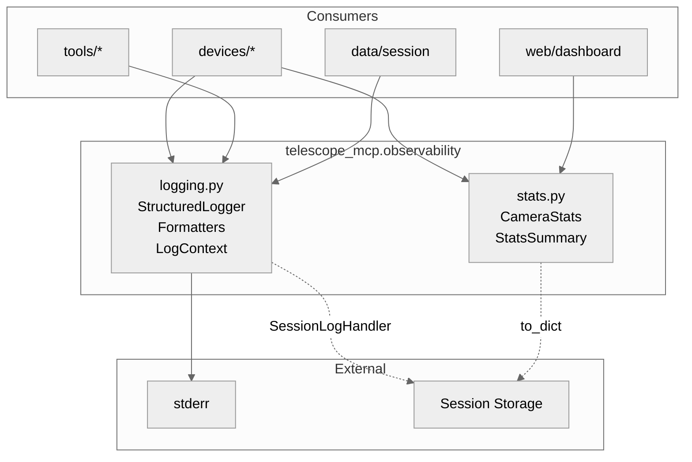
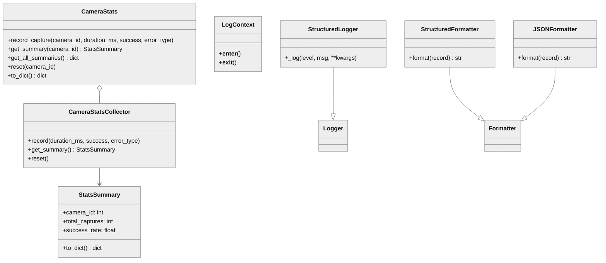

# Observability Module Architecture

## 1. Component Overview

| Attribute | Value |
|-----------|-------|
| **Name** | `telescope_mcp.observability` |
| **Type** | package |
| **Responsibility** | Structured logging + camera performance metrics |
| **Context** | Internal infrastructure for telescope-mcp |
| **Patterns** | Singleton, Context Manager, Strategy, Rolling Window |
| **Language** | Python 3.13+ |
| **Runtime** | CPython |
| **Stack** | stdlib logging, contextvars, threading, dataclasses |
| **State** | Stateful (module-level singletons) |

**Entry Points:**
- `get_logger(name)` → StructuredLogger
- `CameraStats()` → create and inject via DI
- `configure_logging(...)` → None

**Key Decisions:**
- Uses `contextvars` for async-safe log context (not thread-local)
- Rolling window via `deque(maxlen=N)` bounds memory
- CameraStats injected via DI for testability

**Risks:** Log injection if untrusted data in message strings (use kwargs instead)

---

## 2. Code Layout

```
observability/
├── __init__.py      # Public API exports
├── logging.py       # Structured logging system (StructuredLogger, formatters, context)
├── stats.py         # Camera metrics (CameraStats, StatsSummary, percentiles)
└── README.md        # This file
```

---

## 3. Public Surface

### 🔒 Frozen APIs (DO NOT MODIFY signatures)

#### logging.py

| Export | Signature | Stability |
|--------|-----------|-----------|
| `get_logger` | `(name: str) -> StructuredLogger` | 🔒 frozen |
| `configure_logging` | `(level=INFO, json_format=False, stream=None, include_structured=True) -> None` | 🔒 frozen |
| `LogContext` | `(**kwargs: Any)` context manager | 🔒 frozen |
| `StructuredLogger` | extends `logging.Logger`, accepts `**kwargs` in log methods | 🔒 frozen |
| `StructuredFormatter` | `(fmt=None, datefmt=None, include_structured=True)` | 🔒 frozen |
| `JSONFormatter` | `()` | 🔒 frozen |
| `SessionLogHandler` | `(session_manager_getter: Callable, level=NOTSET)` | 🔒 frozen |

#### stats.py

| Export | Signature | Stability |
|--------|-----------|-----------|
| `CameraStats` | `(window_size=1000)` | 🔒 frozen |
| `CameraStats.record_capture` | `(camera_id, duration_ms, success, error_type=None)` | 🔒 frozen |
| `CameraStats.get_summary` | `(camera_id) -> StatsSummary` | 🔒 frozen |
| `CameraStats.get_all_summaries` | `() -> dict[int, StatsSummary]` | 🔒 frozen |
| `CameraStats.reset` | `(camera_id=None)` | 🔒 frozen |
| `CameraStats.to_dict` | `() -> dict[str, Any]` | 🔒 frozen |
| `StatsSummary` | dataclass with `to_dict()` | 🔒 frozen |

### ⚠️ Internal (may change)

| Symbol | Location | Purpose |
|--------|----------|---------|
| `_log_context` | logging.py | ContextVar for log context |
| `_configured` | logging.py | Config state flag |
| `_config_lock` | logging.py | Threading lock |
| `_configure_logging_impl` | logging.py | Internal config helper |
| `_format_value` | logging.py | Value formatter |
| `_percentile` | stats.py | Percentile calculator |
| `CameraStatsCollector` | stats.py | Per-camera collector |
| `CaptureRecord` | stats.py | Internal record type |

### Change Impact

| If you modify... | Breaks... |
|------------------|-----------|
| `get_logger` signature | All modules using logging |
| `StatsSummary` fields | Session storage, dashboards, API responses |
| `LogContext` protocol | All structured logging call sites |
| `CameraStats` constructor | Camera initialization code |

### Data Contracts

**Inputs:**
- `camera_id: int` (0=finder, 1=main)
- `duration_ms: float` (capture time)
- `success: bool`
- `error_type: str | None` ('timeout', 'disconnected', etc.)

**Outputs:**
- `StatsSummary.to_dict()` → JSON-serializable dict
- `CameraStats.to_dict()` → `{"cameras": {"0": {...}}, "timestamp": "ISO8601"}`
- Log output → stderr (default) or custom stream

---

## 4. Dependencies

### depends_on
| Dependency | Purpose |
|------------|---------|
| `logging` (stdlib) | Base logging infrastructure |
| `threading` (stdlib) | Lock primitives |
| `contextvars` (stdlib) | Async-safe context |
| `dataclasses` (stdlib) | Data structures |
| `json` (stdlib) | JSON formatting |
| `collections.deque` | Rolling window |

### required_by
| Consumer | Usage |
|----------|-------|
| `telescope_mcp.devices.*` | Logging + stats recording |
| `telescope_mcp.tools.*` | Logging |
| `telescope_mcp.data.session` | SessionLogHandler integration |
| `telescope_mcp.web` | Stats export for dashboard |

### Interfaces
| Type | Details |
|------|---------|
| Stream | `sys.stderr` (default), any file-like |
| Protocol | `SessionManagerProtocol.log(level, message, source, **kwargs)` |

---

## 5. Invariants & Errors

### ⚠️ Invariants (MUST PRESERVE)

| Invariant | Threshold | Verification |
|-----------|-----------|--------------|
| Thread-safe stats | N/A | `test_thread_safety` |
| Bounded memory | `window_size` records max | `deque(maxlen=N)` enforced |
| `StatsSummary` consistency | `successful + failed == total` | Computed in `get_summary()` |
| Context isolation | Per-async-task | Uses `contextvars.ContextVar` |
| Idempotent config | First call wins | `_configured` flag + lock |

### Verification Commands
```bash
pdm run pytest tests/test_observability.py -v
pdm run pytest tests/test_observability.py --cov=telescope_mcp.observability
```

### Constraints

| Type | Constraint |
|------|------------|
| **Perf** | Lock held briefly (microseconds) |
| **Perf** | `get_summary()` sorts durations O(n log n) |
| **Concurrency** | All public methods thread-safe |
| **Security** | Don't put untrusted data in log message strings |

### Side Effects

| Function | Side Effect |
|----------|-------------|
| `configure_logging()` | Modifies `logging` module state, adds handlers |
| `get_logger()` | May call `configure_logging()` on first use |
| `record_capture()` | Mutates collector state |
| `SessionLogHandler.emit()` | Writes to session storage |

### Errors

| Error | When Raised |
|-------|-------------|
| None | Module designed for graceful degradation |
| `handleError()` | SessionLogHandler catches all, delegates to logging |

---

## 6. Usage

### Setup
```python
from telescope_mcp.observability import get_logger, LogContext, CameraStats

# Logging
logger = get_logger(__name__)
logger.info("Event", camera_id=0, duration_ms=150)

with LogContext(session_id="abc"):
    logger.info("Scoped log")  # includes session_id

# Stats (inject via DI)
stats = CameraStats()
camera = Camera(driver, config, stats=stats)  # Inject into camera

# Or use directly
stats.record_capture(camera_id=0, duration_ms=150, success=True)
summary = stats.get_summary(camera_id=0)
```

### Configuration

| Config | Default | Options |
|--------|---------|---------|
| `level` | `INFO` | `DEBUG`, `INFO`, `WARNING`, `ERROR` |
| `json_format` | `False` | `True` for NDJSON output |
| `stream` | `sys.stderr` | Any file-like |
| `window_size` | 1000 | Records per camera |

### Testing
```bash
# Run observability tests
pdm run pytest tests/test_observability.py

# With coverage
pdm run pytest tests/test_observability.py --cov=telescope_mcp.observability --cov-report=term-missing
```

### Pitfalls

| Pitfall | Fix |
|---------|-----|
| Log injection | Use kwargs: `logger.info("msg", user=input)` not f-strings |
| Duplicate logs | `configure_logging()` is idempotent, but don't add handlers manually |
| Stale stats | Call `stats.reset()` when starting new session |

---

## 7. AI-Accessibility Map

| Task | Target | Guards | Change Impact |
|------|--------|--------|---------------|
| Add log field | `StructuredLogger._log()` | kwargs only | None if additive |
| Add stat metric | `StatsSummary`, `get_summary()` | Add field + compute | Breaks serialization consumers |
| Change format | `StructuredFormatter.format()` | Tests | Log parsers |
| Add error type | `record_capture()` call sites | None | Additive safe |
| New formatter | Create class, update `configure_logging()` | Strategy pattern | None if additive |
| Change CameraStats init | `CameraStats.__init__` | DI pattern | Camera initialization |
| Modify percentile | `_percentile()` | Math correctness | Stats accuracy |

---

## 8. Diagrams

### Module Boundaries



### Class Structure


