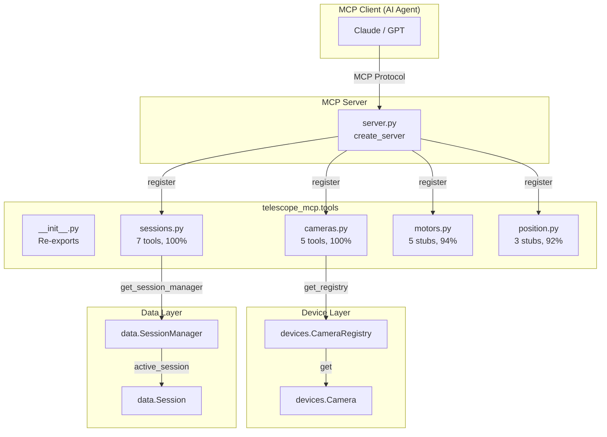
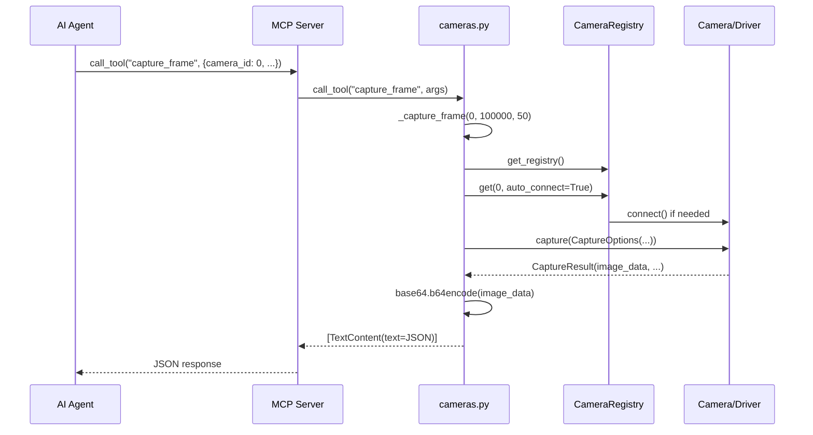

# telescope_mcp.tools Architecture

> **AI Navigation**: MCP tool layer exposing telescope operations to AI agents via Model Context Protocol.
> Entry via `cameras.register()`, `sessions.register()`, `motors.register()`, `position.register()`.

| Aspect | Details |
|--------|---------|
| **Purpose** | Expose telescope hardware and session management to AI agents (Claude, GPT) via MCP tool protocol |
| **Stability** | ⚠️ **Semi-Stable** - Tool schemas are public API; implementations evolve |
| **Boundaries** | Consumed by `server.py`; depends on `devices`, `data`, `drivers.config`, `observability` |
| **Test Command** | `pdm run pytest tests/test_tools*.py tests/test_coverage_gaps.py -v` |

---

## 1. Overview

The `tools` package defines MCP (Model Context Protocol) tools that enable AI agents to control telescope hardware and manage observation sessions. Each module provides:

1. **TOOLS list**: Tool definitions with JSON schemas
2. **register(server)**: Handler registration with MCP server
3. **Implementation functions**: Async handlers for each tool

**Design Pattern**: Each module follows `TOOLS + register() + _impl()` structure. Tools return `list[TextContent]` with JSON payloads. All errors are caught and returned as JSON error objects rather than raising exceptions.

**Key Insight**: The `cameras` and `sessions` modules are fully functional; `motors` and `position` are stubs awaiting hardware driver implementation.

---

## 2. Layout

```
tools/
├── __init__.py       # Re-exports submodules (cameras, motors, position)
├── cameras.py        # Camera control tools (100% coverage)
├── motors.py         # Motor control tools (stubs, 94% coverage)
├── position.py       # Position sensing tools (stubs, 92% coverage)
└── sessions.py       # Session management tools (100% coverage)
```

| File | Role | Status |
|------|------|--------|
| `__init__.py` | Package exports | ✅ Stable |
| `cameras.py` | Camera discovery, capture, control | ✅ **ACTIVE** |
| `motors.py` | Altitude/azimuth motor control | ⏳ **STUBS** |
| `position.py` | Position sensing, goto, calibration | ⏳ **STUBS** |
| `sessions.py` | Session lifecycle, logging, events | ✅ **ACTIVE** |

---

## 3. Public Surface

### 3.1 Package Exports (`__init__.py`)

```python
from telescope_mcp.tools import cameras, motors, position
# Note: sessions not in __all__ but imported by server.py directly
```

### 3.2 cameras.py — Camera Control Tools

| Symbol | Type | Stability | Description |
|--------|------|-----------|-------------|
| `TOOLS` | `list[Tool]` | 🟢 Frozen | 5 tool definitions (list_cameras, get_camera_info, capture_frame, set/get_camera_control) |
| `register(server)` | `(Server) -> None` | 🟢 Frozen | Register tools with MCP server |

**Tool Schemas** (frozen public API):

| Tool Name | Required Args | Optional Args | Returns |
|-----------|---------------|---------------|---------|
| `list_cameras` | — | — | `{count, cameras: [{id, name, max_width, max_height}]}` |
| `get_camera_info` | `camera_id: int` | — | `{camera_id, info: {...}, is_connected}` |
| `capture_frame` | `camera_id: int` | `exposure_us`, `gain` | `{camera_id, exposure_us, gain, timestamp, image_base64}` |
| `set_camera_control` | `camera_id`, `control`, `value` | — | `{camera_id, control, value, auto}` |
| `get_camera_control` | `camera_id`, `control` | — | `{camera_id, control, value, auto}` |

### 3.3 sessions.py — Session Management Tools

| Symbol | Type | Stability | Description |
|--------|------|-----------|-------------|
| `TOOLS` | `list[Tool]` | 🟢 Frozen | 7 tool definitions |
| `register(server)` | `(Server) -> None` | 🟢 Frozen | Register tools with MCP server |

**Tool Schemas** (frozen public API):

| Tool Name | Required Args | Optional Args | Returns |
|-----------|---------------|---------------|---------|
| `start_session` | `session_type: str` | `target`, `purpose` | `{status, session_id, session_type, target, purpose, start_time}` |
| `end_session` | — | — | `{status, session_id, session_type, file_path}` |
| `get_session_info` | — | — | `{session_id, session_type, target, duration_seconds, metrics}` |
| `session_log` | `message: str` | `level`, `source` | `{status, level, message, source, session_id}` |
| `session_event` | `event: str` | `details: object` | `{status, event, details, session_id}` |
| `get_data_dir` | — | — | `{data_dir, exists}` |
| `set_data_dir` | `path: str` | — | `{status, data_dir, exists, note}` |

### 3.4 motors.py — Motor Control Tools (STUBS)

| Symbol | Type | Stability | Description |
|--------|------|-----------|-------------|
| `TOOLS` | `list[Tool]` | 🟡 Internal | 5 tool definitions (stubs) |
| `register(server)` | `(Server) -> None` | 🟡 Internal | Placeholder - tools not yet wired |
| `move_altitude()` | async | 🔴 Unstable | Stub returning "not yet implemented" |
| `move_azimuth()` | async | 🔴 Unstable | Stub returning "not yet implemented" |
| `stop_motors()` | async | 🔴 Unstable | Stub returning "not yet implemented" |
| `get_motor_status()` | async | 🔴 Unstable | Stub returning "not yet implemented" |
| `home_motors()` | async | 🔴 Unstable | Stub returning "not yet implemented" |

### 3.5 position.py — Position Sensing Tools (STUBS)

| Symbol | Type | Stability | Description |
|--------|------|-----------|-------------|
| `TOOLS` | `list[Tool]` | 🟡 Internal | 3 tool definitions (stubs) |
| `register(server)` | `(Server) -> None` | 🟡 Internal | Placeholder - tools not yet wired |
| `get_position()` | async | 🔴 Unstable | Stub returning "not yet implemented" |
| `calibrate_position()` | async | 🔴 Unstable | Stub returning "not yet implemented" |
| `goto_position()` | async | 🔴 Unstable | Stub returning "not yet implemented" |

---

## 4. Dependencies

### 4.1 Internal Dependencies

```
tools/
├── cameras.py
│   ├── telescope_mcp.devices (CaptureOptions, get_registry)
│   └── telescope_mcp.observability (get_logger)
├── motors.py
│   └── telescope_mcp.observability (get_logger)
├── position.py
│   └── telescope_mcp.observability (get_logger)
└── sessions.py
    ├── telescope_mcp.data (LogLevel, SessionType)
    ├── telescope_mcp.drivers.config (get_factory, get_session_manager, set_data_dir)
    └── telescope_mcp.observability (get_logger)
```

### 4.2 External Dependencies

| Package | Purpose | Version |
|---------|---------|---------|
| `mcp` | Model Context Protocol SDK | ≥1.0 |
| `mcp.server.Server` | Server instance for registration | — |
| `mcp.types.Tool`, `TextContent` | Tool definitions and responses | — |

### 4.3 Dependency Injection

All implementation functions support optional `registry` or `manager` parameters for testing:

```python
# cameras.py - inject CameraRegistry
async def _list_cameras(*, registry: "CameraRegistry | None" = None) -> list[TextContent]:
    registry = registry or get_registry()
    ...

# sessions.py - inject SessionManager
async def _start_session(..., *, manager: "SessionManager | None" = None) -> list[TextContent]:
    manager = manager or get_session_manager()
    ...
```

---

## 5. Invariants & Contracts

### 5.1 Tool Registration

1. **MCP Handler Pattern**: `register(server)` attaches `@server.list_tools()` and `@server.call_tool()` decorators
2. **Tool Discovery**: `list_tools()` returns module's `TOOLS` list unchanged
3. **Error Handling**: All `_*` implementations catch exceptions and return JSON error objects

### 5.2 Response Format

All tool implementations return `list[TextContent]` with JSON string:

```python
# Success response
[TextContent(type="text", text='{"success": true, "data": {...}}')]

# Error response
[TextContent(type="text", text='{"error": "error_type", "message": "details"}')]
```

### 5.3 Camera Tool Contracts

| Invariant | Enforcement |
|-----------|-------------|
| Camera auto-connects on access | `registry.get(camera_id, auto_connect=True)` |
| ASI_ prefix stripped for backwards compat | `control.replace("ASI_", "")` |
| Images returned as base64 JPEG | `base64.b64encode(capture_result.image_data)` |

### 5.4 Session Tool Contracts

| Invariant | Enforcement |
|-----------|-------------|
| Cannot start IDLE sessions manually | Explicit check in `_start_session` |
| Cannot end IDLE sessions | Returns `no_session` error |
| Session type validated against enum | `SessionType(session_type.lower())` |
| Log level validated against enum | `LogLevel(level.upper())` |
| Data dir path must be absolute | `Path(path).resolve().is_absolute()` check |

---

## 6. Usage Examples

### 6.1 Registering Tools with Server

```python
from mcp.server import Server
from telescope_mcp.tools import cameras, sessions

server = Server("telescope-mcp")
cameras.register(server)
sessions.register(server)
# Tools now available via MCP protocol
```

### 6.2 Testing with Dependency Injection

```python
from unittest.mock import MagicMock
from telescope_mcp.tools.cameras import _list_cameras

async def test_list_cameras():
    mock_registry = MagicMock()
    mock_registry.discover.return_value = {
        0: MagicMock(name="ASI120MC", max_width=1920, max_height=1080)
    }

    result = await _list_cameras(registry=mock_registry)
    assert '"count": 1' in result[0].text
```

### 6.3 MCP Client Invocation (AI Agent)

```json
// Tool call from AI agent
{
  "name": "capture_frame",
  "arguments": {
    "camera_id": 0,
    "exposure_us": 100000,
    "gain": 50
  }
}

// Response
{
  "camera_id": 0,
  "exposure_us": 100000,
  "gain": 50,
  "timestamp": "2025-01-15T10:30:00.000Z",
  "image_base64": "..."
}
```

---

## 7. AI Accessibility Map

### 7.1 Quick Reference

| Task | Entry Point | Key Functions |
|------|-------------|---------------|
| Add new camera tool | `cameras.py` | Add to `TOOLS`, add branch in `call_tool`, create `_impl()` |
| Add new session tool | `sessions.py` | Add to `TOOLS`, add branch in `call_tool`, create `_impl()` |
| Implement motor control | `motors.py` | Replace stub implementations, wire `register()` |
| Implement position sensing | `position.py` | Replace stub implementations, wire `register()` |
| Test tool with mock | Any `_impl()` | Pass `registry=` or `manager=` kwarg |

### 7.2 Test Files

| Test File | Coverage Target |
|-----------|-----------------|
| `tests/test_tools.py` | General tool tests, motor/position stubs |
| `tests/test_tools_cameras.py` | Camera tools comprehensive |
| `tests/test_tools_sessions.py` | Session tools comprehensive |
| `tests/test_coverage_gaps.py` | Motor/position stub coverage |

### 7.3 Extension Patterns

**Adding a New Tool**:

```python
# 1. Add tool definition to TOOLS list
TOOLS = [
    ...,
    Tool(
        name="new_tool",
        description="Description for AI",
        inputSchema={
            "type": "object",
            "properties": {...},
            "required": [...],
        },
    ),
]

# 2. Add routing in call_tool
@server.call_tool()
async def call_tool(name: str, arguments: dict) -> list[TextContent]:
    ...
    elif name == "new_tool":
        return await _new_tool(arguments["arg1"], ...)
    ...

# 3. Implement handler with DI support
async def _new_tool(
    arg1: str,
    *,
    registry: "CameraRegistry | None" = None,
) -> list[TextContent]:
    """Docstring following Google style."""
    try:
        registry = registry or get_registry()
        # Implementation
        return [TextContent(type="text", text=json.dumps(result))]
    except Exception as e:
        logger.exception("Error in new_tool")
        return [TextContent(type="text", text=json.dumps({"error": "internal", "message": str(e)}))]
```

---

## 8. Architecture Diagram



### Data Flow: capture_frame Tool



---

## 9. Coverage Status

| Module | Statements | Branches | Coverage |
|--------|------------|----------|----------|
| `__init__.py` | 2/2 | 0/0 | **100%** |
| `cameras.py` | 84/84 | 14/14 | **100%** |
| `motors.py` | 16/17 | 0/0 | 94% |
| `position.py` | 12/13 | 0/0 | 92% |
| `sessions.py` | 115/115 | 22/22 | **100%** |
| **TOTAL** | 229/231 | 36/36 | **99%** |

**Note**: `motors.py` line 126 and `position.py` line 82 are uncovered `register()` placeholder `pass` statements.
