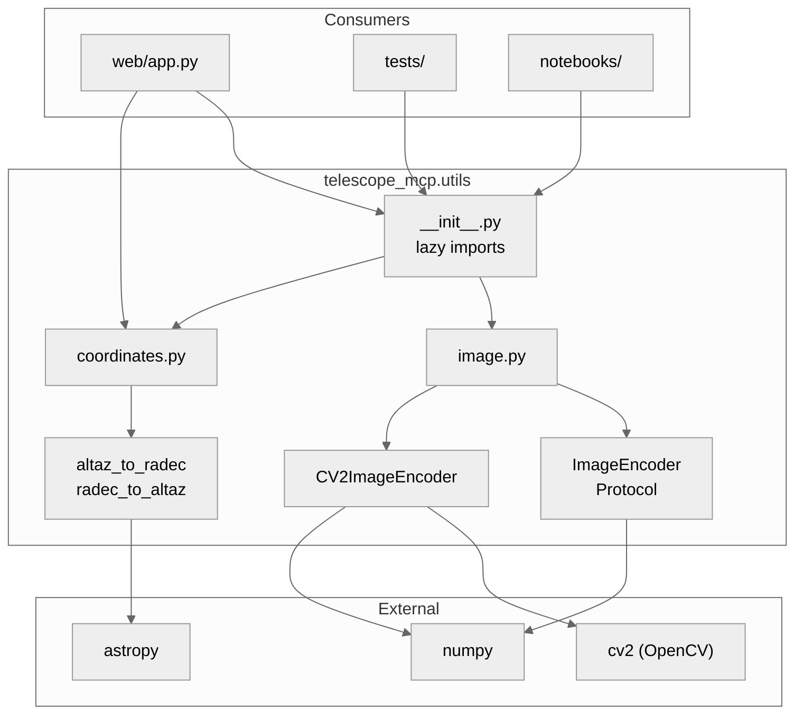
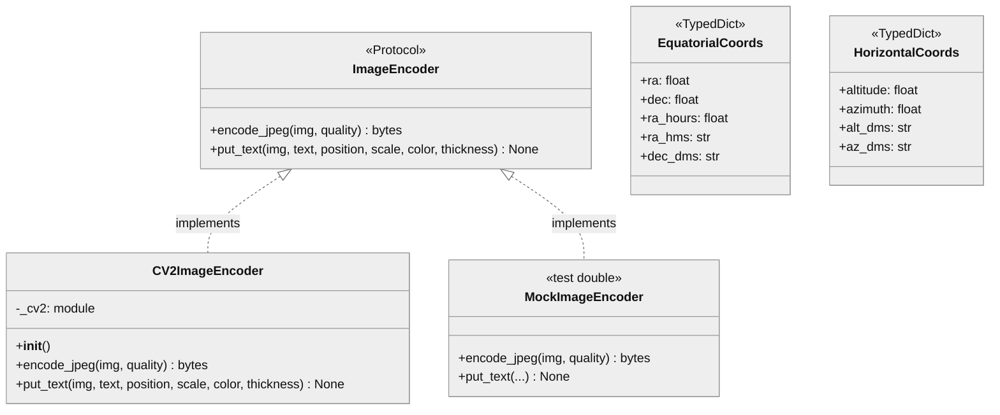

# telescope_mcp.utils

## 1. Component Overview

| Attribute | Value |
|-----------|-------|
| **Name** | `telescope_mcp.utils` |
| **Type** | package |
| **Responsibility** | Image encoding abstractions + astronomical coordinate conversion |
| **Context** | Isolates cv2 dependency for testability; provides ALT/AZ ↔ RA/Dec conversion |
| **Public Surface** | `ImageEncoder`, `CV2ImageEncoder`, `altaz_to_radec`, `radec_to_altaz`, `EquatorialCoords` |
| **Patterns** | Protocol-based DI, Lazy Import, Strategy, Pure Functions |
| **Language** | Python 3.13+ |
| **Runtime** | CPython |
| **Stack** | OpenCV (cv2), NumPy, Astropy |
| **Entry Points** | `CV2ImageEncoder()`, `altaz_to_radec()`, `radec_to_altaz()` |
| **State** | Stateless |
| **Key Decisions** | Lazy cv2 import avoids Python 3.13 cv2.typing bug; Astropy for accurate coordinate transforms |
| **Risks** | cv2 import failure if OpenCV not installed; astropy is heavy dependency |
| **Owners** | telescope-mcp maintainers |

## 2. Code Layout

```
utils/
├── __init__.py      # Lazy import facade; exports all public symbols
├── image.py         # ImageEncoder protocol + CV2ImageEncoder implementation
├── coordinates.py   # ALT/AZ ↔ RA/Dec conversion using astropy
└── README.md        # This file
```

## 3. Public Surface

### ⚠️ DO NOT MODIFY WITHOUT APPROVAL

#### Image Encoding (image.py)

| Export | Type | Stability | Signature |
|--------|------|-----------|-----------|
| `ImageEncoder` | Protocol | 🔒 frozen | `@runtime_checkable class ImageEncoder(Protocol)` |
| `CV2ImageEncoder` | Class | 🔒 frozen | `class CV2ImageEncoder(ImageEncoder)` |

#### Coordinate Conversion (coordinates.py)

| Export | Type | Stability | Signature |
|--------|------|-----------|-----------|
| `EquatorialCoords` | TypedDict | 🔒 frozen | `{ra, dec, ra_hours, ra_hms, dec_dms}` |
| `altaz_to_radec` | Function | 🔒 frozen | `(alt, az, *, lat, lon, elevation?, obstime?) -> EquatorialCoords` |
| `radec_to_altaz` | Function | 🔒 frozen | `(ra, dec, *, lat, lon, elevation?, obstime?) -> HorizontalCoords` |
| `format_ra_hms` | Function | 🔒 frozen | `(ra_degrees) -> str` |
| `format_dec_dms` | Function | 🔒 frozen | `(dec_degrees) -> str` |

### Method Signatures

```python
# ImageEncoder Protocol
def encode_jpeg(img: NDArray[Any], quality: int = 85) -> bytes
def put_text(img: NDArray[Any], text: str, position: tuple[int, int],
             scale: float, color: int | tuple[int, int, int], thickness: int) -> None

# CV2ImageEncoder (same interface)
def __init__() -> None  # Imports cv2 lazily

# Coordinate Conversion
def altaz_to_radec(
    altitude: float, azimuth: float, *,
    lat: float, lon: float,
    elevation: float = 0.0,
    obstime: datetime | None = None
) -> EquatorialCoords

def radec_to_altaz(
    ra: float, dec: float, *,
    lat: float, lon: float,
    elevation: float = 0.0,
    obstime: datetime | None = None
) -> HorizontalCoords

def format_ra_hms(ra_degrees: float) -> str  # "12h 34m 56.7s"
def format_dec_dms(dec_degrees: float) -> str  # "+23° 45' 12.3\""
```

### Change Impact

| If Modified | Breaks |
|-------------|--------|
| `ImageEncoder` signature | `web/app.py`, all mock implementations in tests |
| `CV2ImageEncoder` removal | Production streaming, notebook integrations |
| Lazy import removal | Python 3.13 cv2.typing import errors |
| `EquatorialCoords` fields | `web/app.py` position endpoint, dashboard JS |
| `altaz_to_radec` signature | `web/app.py` position endpoint |

### Data Contracts

| Method | Input | Output |
|--------|-------|--------|
| `encode_jpeg` | NDArray uint8/uint16, H×W or H×W×3 BGR | JPEG bytes (0xFFD8 magic) |
| `put_text` | NDArray (modified in-place) | None |
| `altaz_to_radec` | alt (0-90°), az (0-360°), lat, lon, elevation, obstime | `EquatorialCoords` TypedDict |
| `radec_to_altaz` | ra (0-360°), dec (-90 to +90°), lat, lon, elevation, obstime | `HorizontalCoords` TypedDict |

## 4. Dependencies

### Depends On

| Dependency | Type | Purpose |
|------------|------|---------|
| `cv2` (OpenCV) | External | JPEG encoding, text rendering |
| `numpy` | External | Image array types || `astropy` | External | Coordinate transforms (ALT/AZ ↔ RA/Dec) || `typing.Protocol` | Stdlib | Interface definition |

### Required By

| Consumer | Usage |
|----------|-------|
| `telescope_mcp.web.app` | Stream encoding, error overlays, coordinate conversion |
| `tests/test_web_app.py` | MockImageEncoder for testing |
| `tests/test_utils_coordinates.py` | Coordinate conversion tests |
| `notebooks/test_camera_integration.ipynb` | Direct CV2ImageEncoder usage |

### Interfaces

| Type | Details |
|------|---------|
| Import | `from telescope_mcp.utils import ImageEncoder, CV2ImageEncoder` |
| Import (direct) | `from telescope_mcp.utils.image import ...` |

## 5. Invariants & Errors

### ⚠️ MUST PRESERVE

| Invariant | Threshold | Verification |
|-----------|-----------|--------------|
| JPEG quality range | 1-100 inclusive | `ValueError` if outside |
| JPEG magic bytes | `0xFFD8` prefix | Returned bytes start with magic |
| `@runtime_checkable` | Required | `isinstance(obj, ImageEncoder)` must work |
| RA range | 0-360° | Wrapped by astropy |
| Dec range | -90 to +90° | Clamped by astropy |
| Alt range | -90 to +90° | Zenith=90, horizon=0, nadir=-90 |
| Az range | 0-360° | North=0, East=90, South=180, West=270 |

### Verification

```bash
pdm run pytest tests/test_utils_image.py tests/test_utils_init.py tests/test_utils_coordinates.py -v
```

### Constraints

| Type | Constraint |
|------|------------|
| Performance | `encode_jpeg` ~1-5ms for 640×480 |
| Thread Safety | cv2 encoding is thread-safe; concurrent encoders OK |
| Memory | Input array not copied; output bytes allocate new buffer |

### Side Effects

| Method | Side Effect |
|--------|-------------|
| `CV2ImageEncoder.__init__` | Imports cv2 module |
| `put_text` | Modifies input array in-place |

### Errors

| Error | Condition |
|-------|-----------|
| `ValueError` | quality < 1 or > 100 |
| `ValueError` | cv2.imencode returns failure |
| `ImportError` | cv2 not installed (on `__init__`) |
| `AttributeError` | Unknown attribute via `__getattr__` |

## 6. Usage

### Basic Setup

```python
# Image encoding
from telescope_mcp.utils import CV2ImageEncoder
encoder = CV2ImageEncoder()
jpeg = encoder.encode_jpeg(camera_frame, quality=85)

# Coordinate conversion
from telescope_mcp.utils.coordinates import altaz_to_radec, format_ra_hms, format_dec_dms

# Convert telescope position to celestial coordinates
equatorial = altaz_to_radec(
    altitude=45.0, azimuth=180.0,
    lat=30.27, lon=-97.74  # Austin, TX
)
print(f"RA: {equatorial['ra_hms']}, Dec: {equatorial['dec_dms']}")
# Output: RA: 12h 34m 56.7s, Dec: +23° 45' 12.3"
```

### Testing (Mock)

```python
class MockImageEncoder:
    def encode_jpeg(self, img, quality=85):
        return b'\xff\xd8mock'
    def put_text(self, img, text, position, scale, color, thickness):
        pass

# Pass mock to components under test
app = create_app(mock_registry, encoder=MockImageEncoder())
```

### Configuration

| Config | Default | Description |
|--------|---------|-------------|
| None | — | No configuration required |

### Testing

```bash
# Run utils tests
pdm run pytest tests/test_utils_image.py tests/test_utils_init.py tests/test_utils_coordinates.py -v

# Coverage
pdm run pytest tests/test_utils_image.py tests/test_utils_coordinates.py --cov=telescope_mcp.utils --cov-branch
```

### Pitfalls

| Issue | Fix |
|-------|-----|
| Import error on Python 3.13 | Use lazy import via `__init__.py`, not direct `from image import` |
| Mock doesn't pass `isinstance` check | Ensure mock has both `encode_jpeg` and `put_text` methods |
| `put_text` seems to do nothing | It modifies array in-place; check the array after call |
| RA/Dec seems wrong | Ensure correct lat/lon (decimal degrees), check obstime |
| Coordinate conversion slow | astropy first import is slow; subsequent calls are fast |

## 7. AI-Accessibility Map

| Task | Target | Guards | Change Impact |
|------|--------|--------|---------------|
| Add new encoder method | `image.py:ImageEncoder` | Update Protocol + all implementations | Breaks mocks |
| Change JPEG quality range | `image.py:CV2ImageEncoder.encode_jpeg` | Update validation + tests | May break callers expecting old range |
| Add new image format | `image.py:CV2ImageEncoder` | Add new method + Protocol | Need mock updates |
| Fix cv2 import issue | `__init__.py:__getattr__` | Preserve lazy pattern | May break if eager import |
| Mock encoder in tests | Create class with same methods | Must match Protocol | None if Protocol-compliant |
| Add coordinate field | `coordinates.py:EquatorialCoords` | Update TypedDict + all consumers | web/app.py, dashboard.js |
| Change coordinate format | `coordinates.py:format_*` | Update tests | Dashboard display |
| Add new coordinate system | `coordinates.py` | Add function + TypedDict | None if additive |

## 8. Diagrams

### Component Boundaries



### Class Hierarchy


