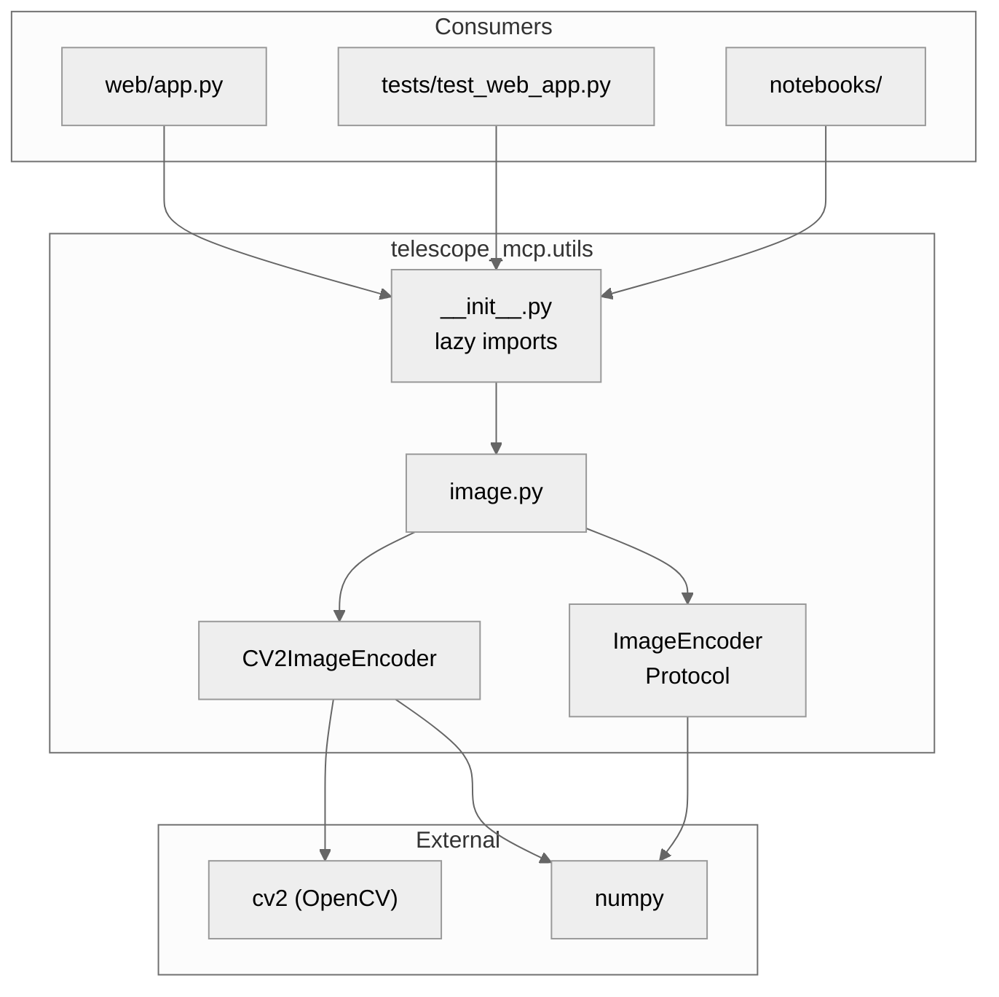
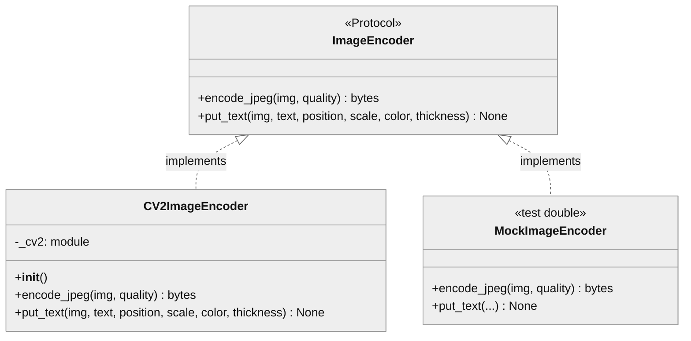

# telescope_mcp.utils

## 1. Component Overview

| Attribute | Value |
|-----------|-------|
| **Name** | `telescope_mcp.utils` |
| **Type** | package |
| **Responsibility** | Image encoding abstractions for dependency injection |
| **Context** | Isolates cv2 dependency for testability; defers cv2 import to avoid Python 3.13 issues |
| **Public Surface** | `ImageEncoder`, `CV2ImageEncoder` |
| **Patterns** | Protocol-based DI, Lazy Import, Strategy |
| **Language** | Python 3.13+ |
| **Runtime** | CPython |
| **Stack** | OpenCV (cv2), NumPy |
| **Entry Points** | `CV2ImageEncoder()` instantiation |
| **State** | Stateless (encoder holds cv2 module ref only) |
| **Key Decisions** | Lazy cv2 import avoids Python 3.13 cv2.typing bug; Protocol enables mock injection |
| **Risks** | cv2 import failure if OpenCV not installed |
| **Owners** | telescope-mcp maintainers |

## 2. Code Layout

```
utils/
├── __init__.py      # Lazy import facade; exports ImageEncoder, CV2ImageEncoder
├── image.py         # Protocol + real implementation
└── README.md        # This file
```

## 3. Public Surface

### ⚠️ DO NOT MODIFY WITHOUT APPROVAL

| Export | Type | Stability | Signature |
|--------|------|-----------|-----------|
| `ImageEncoder` | Protocol | 🔒 frozen | `@runtime_checkable class ImageEncoder(Protocol)` |
| `CV2ImageEncoder` | Class | 🔒 frozen | `class CV2ImageEncoder(ImageEncoder)` |

### Method Signatures

```python
# ImageEncoder Protocol
def encode_jpeg(img: NDArray[Any], quality: int = 85) -> bytes
def put_text(img: NDArray[Any], text: str, position: tuple[int, int],
             scale: float, color: int | tuple[int, int, int], thickness: int) -> None

# CV2ImageEncoder (same interface)
def __init__() -> None  # Imports cv2 lazily
```

### Change Impact

| If Modified | Breaks |
|-------------|--------|
| `ImageEncoder` signature | `web/app.py`, all mock implementations in tests |
| `CV2ImageEncoder` removal | Production streaming, notebook integrations |
| Lazy import removal | Python 3.13 cv2.typing import errors |

### Data Contracts

| Method | Input | Output |
|--------|-------|--------|
| `encode_jpeg` | NDArray uint8/uint16, H×W or H×W×3 BGR | JPEG bytes (0xFFD8 magic) |
| `put_text` | NDArray (modified in-place) | None |

## 4. Dependencies

### Depends On

| Dependency | Type | Purpose |
|------------|------|---------|
| `cv2` (OpenCV) | External | JPEG encoding, text rendering |
| `numpy` | External | Image array types |
| `typing.Protocol` | Stdlib | Interface definition |

### Required By

| Consumer | Usage |
|----------|-------|
| `telescope_mcp.web.app` | Stream encoding, error overlays |
| `tests/test_web_app.py` | MockImageEncoder for testing |
| `notebooks/test_camera_integration.ipynb` | Direct CV2ImageEncoder usage |

### Interfaces

| Type | Details |
|------|---------|
| Import | `from telescope_mcp.utils import ImageEncoder, CV2ImageEncoder` |
| Import (direct) | `from telescope_mcp.utils.image import ...` |

## 5. Invariants & Errors

### ⚠️ MUST PRESERVE

| Invariant | Threshold | Verification |
|-----------|-----------|--------------|
| JPEG quality range | 1-100 inclusive | `ValueError` if outside |
| JPEG magic bytes | `0xFFD8` prefix | Returned bytes start with magic |
| `@runtime_checkable` | Required | `isinstance(obj, ImageEncoder)` must work |

### Verification

```bash
pdm run pytest tests/test_utils_image.py tests/test_utils_init.py -v
```

### Constraints

| Type | Constraint |
|------|------------|
| Performance | `encode_jpeg` ~1-5ms for 640×480 |
| Thread Safety | cv2 encoding is thread-safe; concurrent encoders OK |
| Memory | Input array not copied; output bytes allocate new buffer |

### Side Effects

| Method | Side Effect |
|--------|-------------|
| `CV2ImageEncoder.__init__` | Imports cv2 module |
| `put_text` | Modifies input array in-place |

### Errors

| Error | Condition |
|-------|-----------|
| `ValueError` | quality < 1 or > 100 |
| `ValueError` | cv2.imencode returns failure |
| `ImportError` | cv2 not installed (on `__init__`) |
| `AttributeError` | Unknown attribute via `__getattr__` |

## 6. Usage

### Basic Setup

```python
from telescope_mcp.utils import CV2ImageEncoder
encoder = CV2ImageEncoder()
jpeg = encoder.encode_jpeg(camera_frame, quality=85)
```

### Testing (Mock)

```python
class MockImageEncoder:
    def encode_jpeg(self, img, quality=85):
        return b'\xff\xd8mock'
    def put_text(self, img, text, position, scale, color, thickness):
        pass

# Pass mock to components under test
app = create_app(mock_registry, encoder=MockImageEncoder())
```

### Configuration

| Config | Default | Description |
|--------|---------|-------------|
| None | — | No configuration required |

### Testing

```bash
# Run utils tests
pdm run pytest tests/test_utils_image.py tests/test_utils_init.py -v

# Coverage
pdm run pytest tests/test_utils_image.py --cov=telescope_mcp.utils.image --cov-branch
```

### Pitfalls

| Issue | Fix |
|-------|-----|
| Import error on Python 3.13 | Use lazy import via `__init__.py`, not direct `from image import` |
| Mock doesn't pass `isinstance` check | Ensure mock has both `encode_jpeg` and `put_text` methods |
| `put_text` seems to do nothing | It modifies array in-place; check the array after call |

## 7. AI-Accessibility Map

| Task | Target | Guards | Change Impact |
|------|--------|--------|---------------|
| Add new encoder method | `image.py:ImageEncoder` | Update Protocol + all implementations | Breaks mocks |
| Change JPEG quality range | `image.py:CV2ImageEncoder.encode_jpeg` | Update validation + tests | May break callers expecting old range |
| Add new image format | `image.py:CV2ImageEncoder` | Add new method + Protocol | Need mock updates |
| Fix cv2 import issue | `__init__.py:__getattr__` | Preserve lazy pattern | May break if eager import |
| Mock encoder in tests | Create class with same methods | Must match Protocol | None if Protocol-compliant |

## 8. Diagrams

### Component Boundaries



### Class Hierarchy


