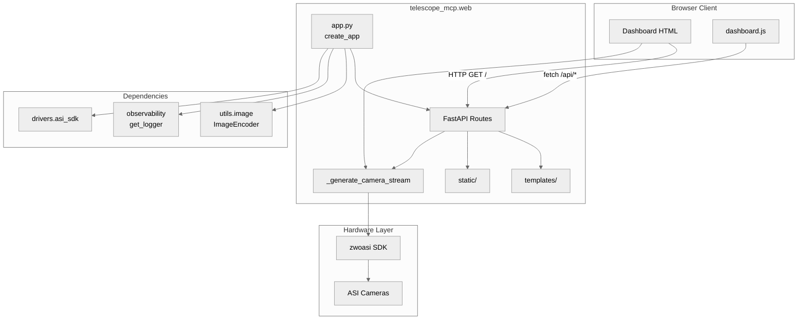
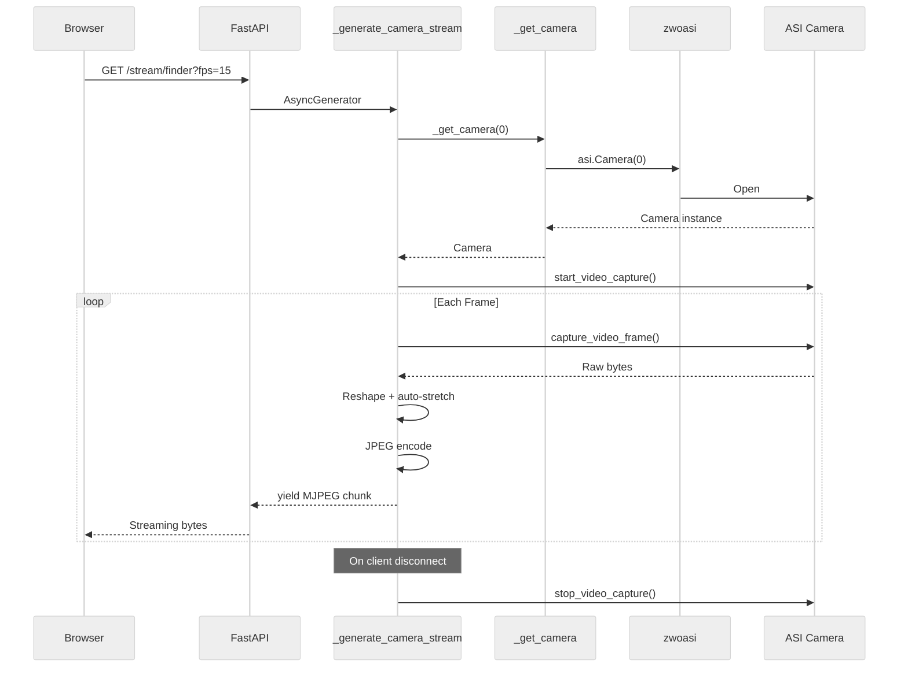

# telescope_mcp.web Architecture

> **AI Navigation**: Web dashboard for telescope control. Entry via `create_app()` factory.
> MJPEG streams at `/stream/*`, REST API at `/api/*`, dashboard UI at `/`.

| Aspect | Details |
|--------|---------|
| **Purpose** | Browser-based telescope control dashboard with live camera streams and motor controls |
| **Stability** | ⚠️ **Semi-Stable** - URL routes frozen; internal helpers evolve |
| **Boundaries** | Consumed by `server.py`; depends on `drivers.asi_sdk`, `utils.image`, `observability` |
| **Test Command** | `pdm run pytest tests/test_web_app.py -v` |

---

## 1. Overview

The `web` package provides a FastAPI application for browser-based telescope control. It serves:

1. **Dashboard UI** (`/`) - HTML interface with camera streams and motor controls
2. **MJPEG Streams** (`/stream/*`) - Live video from ASI cameras
3. **REST API** (`/api/*`) - Camera control, motor commands, position readout

**Design Pattern**: Factory pattern via `create_app(encoder)` enables dependency injection for testing. Global module state (`_cameras`, `_camera_streaming`, `_camera_settings`) manages camera lifecycle.

**Key Insight**: Motor/position endpoints are stubs awaiting hardware integration. Camera streaming is fully functional with real ASI SDK.

---

## 2. Layout

```
web/
├── __init__.py          # Re-exports create_app, main
├── app.py               # FastAPI app, routes, camera streaming (100% coverage)
├── templates/
│   └── dashboard.html   # Jinja2 template for UI
└── static/
    ├── css/
    │   └── dashboard.css    # Dark theme styles
    └── js/
        └── dashboard.js     # Position polling, motor/camera controls
```

| File | Role | Status |
|------|------|--------|
| `__init__.py` | Package exports | ✅ Stable |
| `app.py` | FastAPI application factory + routes | ✅ **ACTIVE** |
| `templates/dashboard.html` | HTML UI template | ✅ Stable |
| `static/css/dashboard.css` | Dashboard styling | ✅ Stable |
| `static/js/dashboard.js` | Client-side interactions | ✅ Stable |

---

## 3. Public Surface

### 3.1 Package Exports (`__init__.py`)

```python
from telescope_mcp.web.app import create_app, main

__all__ = ["create_app", "main"]
```

### 3.2 app.py — FastAPI Application

| Symbol | Type | Stability | Description |
|--------|------|-----------|-------------|
| `create_app(encoder)` | `(ImageEncoder?) -> FastAPI` | 🟢 Frozen | Factory for configured FastAPI app |
| `main()` | `() -> None` | 🟢 Frozen | Entry point, runs uvicorn on 0.0.0.0:8080 |
| `lifespan(app)` | `AsyncContextManager` | 🟡 Internal | Startup/shutdown lifecycle |
| `_init_sdk()` | `() -> None` | 🔴 Private | Lazy ASI SDK initialization |
| `_get_camera(id)` | `(int) -> Camera?` | 🔴 Private | Lazy camera accessor |
| `_close_all_cameras()` | `() -> None` | 🔴 Private | Shutdown cleanup |
| `_generate_camera_stream()` | `AsyncGenerator` | 🔴 Private | MJPEG frame generator |

### 3.3 URL Routes (⚠️ DO NOT MODIFY paths)

| Method | Path | Handler | Returns |
|--------|------|---------|---------|
| GET | `/` | `dashboard` | HTMLResponse (dashboard.html) |
| GET | `/stream/finder` | `finder_stream` | StreamingResponse (MJPEG camera 0) |
| GET | `/stream/main` | `main_stream` | StreamingResponse (MJPEG camera 1) |
| GET | `/stream/{camera_id}` | `camera_stream` | StreamingResponse (MJPEG) |
| GET | `/api/cameras` | `api_list_cameras` | JSONResponse `{count, cameras[]}` |
| POST | `/api/motor/altitude` | `api_move_altitude` | dict (programmatic) |
| POST | `/api/motor/azimuth` | `api_move_azimuth` | dict (programmatic) |
| POST | `/api/motor/altitude/nudge` | `api_nudge_altitude` | dict (tap gesture) |
| POST | `/api/motor/azimuth/nudge` | `api_nudge_azimuth` | dict (tap gesture) |
| POST | `/api/motor/altitude/start` | `api_start_altitude` | dict (hold gesture) |
| POST | `/api/motor/azimuth/start` | `api_start_azimuth` | dict (hold gesture) |
| POST | `/api/motor/stop` | `api_stop_motors` | dict (stop/release) |
| GET | `/api/position` | `api_get_position` | dict (with RA/Dec) |
| POST | `/api/camera/{id}/control` | `api_set_camera_control` | JSONResponse |

### 3.4 Motor Control API (UI Pattern: Tap + Hold)

The motor control API supports two UI interaction patterns:

**Tap (Nudge)**: Single click moves a fixed amount in degrees.
```
POST /api/motor/altitude/nudge?direction=up&degrees=0.1
POST /api/motor/azimuth/nudge?direction=left&degrees=0.5
```

**Hold (Start/Stop)**: Press-and-hold begins continuous motion until released.
```javascript
// JavaScript UI pattern
upBtn.onmousedown = () => fetch('/api/motor/altitude/start?direction=up&speed=50', {method: 'POST'});
upBtn.onmouseup = () => fetch('/api/motor/stop?axis=altitude', {method: 'POST'});
```

**Emergency Stop**: Stop all motors immediately.
```
POST /api/motor/stop
```

| Endpoint | Parameters | Description |
|----------|------------|-------------|
| `POST /api/motor/{axis}/nudge` | `direction`, `degrees` | Move fixed amount (tap) |
| `POST /api/motor/{axis}/start` | `direction`, `speed` | Begin continuous motion (hold) |
| `POST /api/motor/stop` | `axis` (optional) | Stop motion (release/emergency) |
| `POST /api/motor/{axis}` | `steps`, `speed` | Programmatic step-based move |

**Direction Values:**
- Altitude: `up`, `down`
- Azimuth: `cw`, `ccw`, `left`, `right`

**Default Values:**
- `degrees`: 0.1° (nudge)
- `speed`: 50% (start), 100% (step-based)

**Note**: Actual motor movement requires hardware integration (currently stubs).
WebSocket upgrade path available if HTTP latency becomes an issue.

### 3.5 Stream Query Parameters

| Param | Type | Default | Range | Description |
|-------|------|---------|-------|-------------|
| `exposure_us` | int | 100,000 | 1–60,000,000 | Exposure μs |
| `gain` | int | 50 | 0–600 | Camera gain |
| `fps` | int | 15 | 1–60 | Target frame rate |

### 3.6 Camera Control Names

Valid `control` values for `/api/camera/{id}/control`:

| Control | Description |
|---------|-------------|
| `ASI_GAIN` | Amplification (0-500 typical) |
| `ASI_EXPOSURE` | Exposure time (μs) |
| `ASI_GAMMA` | Gamma correction |
| `ASI_WB_R`, `ASI_WB_B` | White balance |
| `ASI_BRIGHTNESS` | Brightness offset |
| `ASI_OFFSET` | Black level |
| `ASI_BANDWIDTHOVERLOAD` | USB bandwidth % |
| `ASI_FLIP` | Image flip mode |
| `ASI_HIGH_SPEED_MODE` | High-speed readout |

---

## 4. Dependencies

### 4.1 Internal Dependencies

```
web/
└── app.py
    ├── telescope_mcp.drivers.asi_sdk (get_sdk_library_path)
    ├── telescope_mcp.observability (get_logger)
    └── telescope_mcp.utils.image (ImageEncoder, CV2ImageEncoder)
```

### 4.2 External Dependencies

| Package | Purpose | Version |
|---------|---------|---------|
| `fastapi` | Web framework | ≥0.100 |
| `uvicorn` | ASGI server | ≥0.20 |
| `jinja2` | HTML templating | ≥3.0 |
| `numpy` | Image array handling | ≥1.24 |
| `zwoasi` | ASI camera SDK wrapper | ≥0.0.20 |

### 4.3 Dependency Injection

```python
# Production (real cv2)
app = create_app()

# Testing (mock encoder)
from telescope_mcp.utils.image import ImageEncoder

class MockEncoder(ImageEncoder):
    def encode_jpeg(self, img, quality=95): return b"mock"
    def put_text(self, img, text, pos, scale, color, thickness): pass

app = create_app(encoder=MockEncoder())
```

---

## 5. Invariants & Contracts

### 5.1 Camera State Management

| State Variable | Type | Invariant |
|----------------|------|-----------|
| `_sdk_initialized` | bool | Set once, never unset (prevents retry storm) |
| `_cameras` | dict[int, Camera] | Lazily populated, cleared on shutdown |
| `_camera_streaming` | dict[int, bool] | True while stream active |
| `_camera_settings` | dict[int, dict] | exposure_us, gain per camera |

### 5.2 Lifecycle Guarantees

| Invariant | Enforcement |
|-----------|-------------|
| SDK init before camera access | `_init_sdk()` called in `_get_camera()` |
| Cameras closed on shutdown | `lifespan` finally block calls `_close_all_cameras()` |
| Video capture stopped on stream end | `_generate_camera_stream` finally block |
| Error frames in-stream (no connection break) | try/except yields error JPEG |

### 5.3 Response Formats

| Endpoint Type | Success | Error |
|---------------|---------|-------|
| REST API | `{"data": ...}` | `{"error": str}` + status code |
| MJPEG Stream | Continuous frames | Error frame (red text on black) |
| HTML | Rendered template | 500 TemplateNotFound |

### 5.4 Stream Frame Format

```
--frame\r\n
Content-Type: image/jpeg\r\n
\r\n
<jpeg_bytes>\r\n
```

---

## 6. Usage Examples

### 6.1 Running the Dashboard

```bash
# Via entry point
pdm run telescope-web

# Via module
pdm run python -m telescope_mcp.web.app

# Programmatic
from telescope_mcp.web import create_app
import uvicorn

app = create_app()
uvicorn.run(app, host="0.0.0.0", port=8080)
```

### 6.2 Embedding in MCP Server

```python
# In server.py
from telescope_mcp.web.app import create_app

def _run_dashboard(host: str, port: int) -> None:
    app = create_app()
    config = uvicorn.Config(app, host=host, port=port)
    server = uvicorn.Server(config)
    server.run()
```

### 6.3 Testing with Mock Encoder

```python
import pytest
from fastapi.testclient import TestClient
from telescope_mcp.web.app import create_app
from telescope_mcp.utils.image import ImageEncoder

class MockEncoder(ImageEncoder):
    def encode_jpeg(self, img, quality=95):
        return b"\xff\xd8\xff\xe0"  # JPEG header
    def put_text(self, *args): pass

@pytest.fixture
def client():
    app = create_app(encoder=MockEncoder())
    return TestClient(app)

def test_dashboard(client):
    response = client.get("/")
    assert response.status_code == 200
    assert "Telescope Control" in response.text
```

### 6.4 Configuration

| Setting | Default | Override |
|---------|---------|----------|
| Host | `0.0.0.0` | Pass to `uvicorn.run()` |
| Port | `8080` | Pass to `uvicorn.run()` |
| Exposure | 100ms | Stream query param |
| Gain | 50 | Stream query param |
| FPS | 15 | Stream query param |

---

## 7. AI Accessibility Map

### 7.1 Quick Reference

| Task | Target | Guards | Change Impact |
|------|--------|--------|---------------|
| Add new API route | `app.py` in `create_app()` | None | Low |
| Modify stream encoding | `_generate_camera_stream()` | Test coverage | Medium |
| Change URL paths | Route decorators | **⚠️ Breaks clients** | High |
| Add camera control | `control_map` dict | SDK support | Low |
| Implement motor control | `api_move_*` stubs | Hardware driver | Medium |
| Change dashboard UI | `templates/dashboard.html` | None | Low |
| Modify styles | `static/css/dashboard.css` | None | Low |
| Update JS behavior | `static/js/dashboard.js` | None | Low |

### 7.2 Test File

| Test File | Coverage Target |
|-----------|-----------------|
| `tests/test_web_app.py` | 100% coverage |

### 7.3 Extension Patterns

**Adding a New API Endpoint**:

```python
# In create_app(), after existing routes:
@app.get("/api/new_endpoint")
async def api_new_endpoint(param: str) -> JSONResponse:
    """Description.

    Args:
        param: Description.

    Returns:
        JSONResponse with result.
    """
    try:
        result = do_something(param)
        return JSONResponse({"result": result})
    except Exception as e:
        return JSONResponse({"error": str(e)}, status_code=500)
```

**Adding Camera Stream Processing**:

```python
# In _generate_camera_stream(), after reshape:
img = np.frombuffer(data, dtype=np.uint8).reshape((height, width))

# Add processing here
img = apply_custom_filter(img)

# Auto-stretch remains
if img.max() > img.min():
    img = ((img - img.min()) * 255 / (img.max() - img.min())).astype(np.uint8)
```

---

## 8. Architecture Diagram



### Request Flow: MJPEG Stream



---

## 9. Coverage Status

| Module | Statements | Branches | Coverage |
|--------|------------|----------|----------|
| `__init__.py` | 2/2 | 0/0 | **100%** |
| `app.py` | 149/149 | 22/22 | **100%** |
| **TOTAL** | 151/151 | 22/22 | **100%** |

---

## 10. Implementation Status

| Component | Status | Notes |
|-----------|--------|-------|
| Dashboard UI | ✅ Complete | HTML/CSS/JS |
| Camera streaming | ✅ Complete | MJPEG with auto-stretch |
| Camera control API | ✅ Complete | Gain, exposure, etc. |
| Camera discovery | ✅ Complete | /api/cameras |
| Motor step-based | ✅ API Ready | Needs hardware driver integration |
| Motor nudge (tap) | ✅ API Ready | Needs hardware driver integration |
| Motor start (hold) | ✅ API Ready | Needs hardware driver integration |
| Motor stop | ✅ API Ready | Needs hardware driver integration |
| Position readout | ✅ API Ready | Returns ALT/AZ + RA/Dec |
