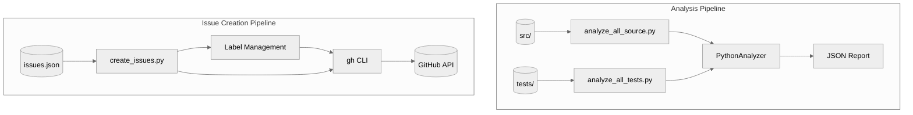
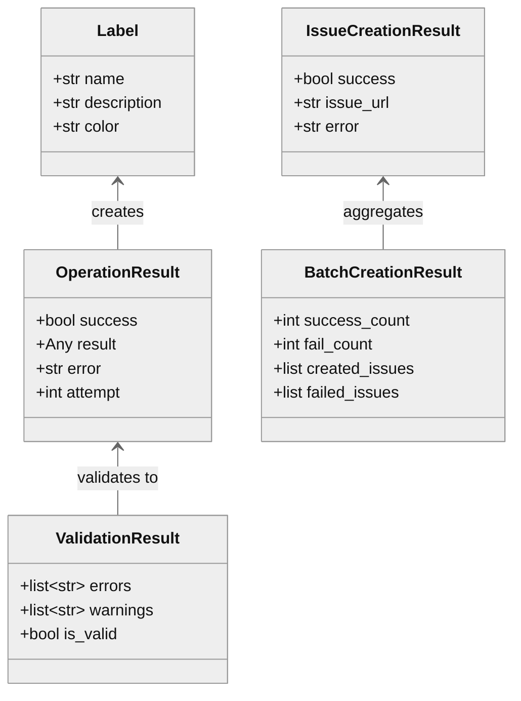

# Utils - Architecture Contract

## 1. Component Overview

| Attribute | Value |
|-----------|-------|
| **Name** | `utils` |
| **Type** | Directory (standalone scripts) |
| **Responsibility** | Batch analysis + GitHub issue automation |
| **Language** | Python 3.10+ |
| **Runtime** | CLI (direct execution) |
| **State** | Stateless |

### Boundaries
- **Context**: Developer workflow, CI/CD pipelines, AI-assisted code review
- **Public Surface**: CLI interface via `python utils/<script>.py`

### Patterns
- Dependency injection (project_root, analyzer params)
- TYPE_CHECKING guard for imports
- JSON I/O for pipeline integration
- Retry w/ exponential backoff (create_issues.py)
- Dataclass-based result types

### Entry Points
| Entry | Purpose |
|-------|---------|
| `python utils/analyze_all_source.py` | Analyze src/ → JSON report |
| `python utils/analyze_all_tests.py` | Analyze tests/ → JSON report |
| `python utils/create_issues.py` | GitHub issue creation from JSON |

### Key Decisions
| Decision | Rationale | Risk |
|----------|-----------|------|
| Standalone scripts | No package install needed | Must run from project root |
| DI parameters | Testability without mocking | Requires caller setup |
| JSON output | Machine-readable for AI prompts | Verbose for humans |
| gh CLI dependency | Leverage existing auth | Requires gh installed |
| Temp file for body | Prevent shell injection | Disk write required |

---

## 2. Code Layout

```
utils/
├── analyze_all_source.py   # Batch analyze src/ → JSON report
├── analyze_all_tests.py    # Batch analyze tests/ → JSON report
├── create_issues.py        # GitHub issue creator w/ label management
└── README.md               # This file
```

---

## 3. Public Surface

### CLI Interface (⚠️ Stable)

#### `analyze_all_source.py`
```bash
python utils/analyze_all_source.py [--output FILE] [--pretty]
```
| Flag | Purpose |
|------|---------|
| `--output, -o` | Write JSON to file (default: stdout) |
| `--pretty, -p` | Pretty-print with indentation |

#### `analyze_all_tests.py`
```bash
python utils/analyze_all_tests.py [--output FILE] [--pretty]
```
| Flag | Purpose |
|------|---------|
| `--output, -o` | Write JSON to file (default: stdout) |
| `--pretty, -p` | Pretty-print with indentation |

#### `create_issues.py`
```bash
python utils/create_issues.py -r owner/repo [OPTIONS]
```
| Flag | Purpose |
|------|---------|
| `--repository, -r` | Target repo (required, format: `owner/repo`) |
| `--issues, -i` | JSON file with issue definitions |
| `--list-labels` | Display labels in AI-friendly format |
| `--create-labels` | Create standard code review labels |
| `--validate-only` | Validate JSON without creating issues |

### Functions (⚠️ Internal)

#### analyze_all_*.py
```python
def find_python_files(target_dir: Path) -> list[Path]  # ⚠️ internal
def analyze_file(analyzer, file_path, project_root) -> dict  # ⚠️ internal
def main(project_root: Path | None, analyzer | None) -> int  # ⚠️ internal (DI)
```

#### create_issues.py
```python
# GitHub CLI wrappers
def check_github_cli_available() -> OperationResult  # ⚠️ internal
def invoke_with_retry(cmd, operation, max_retries) -> OperationResult  # ⚠️ internal
def get_repository_labels(repo: str) -> OperationResult  # ⚠️ internal
def create_label(label: Label, repo: str) -> OperationResult  # ⚠️ internal

# Validation pipeline
def validate_issue(issue, labels, num) -> ValidationResult  # ⚠️ internal
def validate_input_safety(input, field, strict) -> None  # ⚠️ internal

# Orchestration
def main() -> int  # 🔒 frozen (CLI entry)
```

### Data Contracts

#### Analysis JSON Output
```json
{
  "report_type": "source_analysis" | "tests_analysis",
  "generated_at": "ISO8601 timestamp",
  "target_directory": "src" | "tests",
  "files_scanned": int,
  "summary": {
    "total_files": int,
    "files_with_issues": int,
    "total_functions_to_improve": int
  },
  "files": [{
    "file": "relative/path.py",
    "functions_needing_improvement": int,
    "functions": [{
      "name": "func_name",
      "line": int,
      "quality": "poor|basic|good|excellent",
      "priority": int,
      "missing": ["indicator names"],
      "has_docstring": bool
    }]
  }]
}
```

#### Issue Creation JSON Input
```json
{
  "issues": [{
    "title": "string (required, max 1000 chars)",
    "labels": ["p1", "security", "estimate: 2h"],
    "estimate": "2h",
    "body": {
      "location": "src/file.py:L42",
      "current_state": "description",
      "problem": "what's wrong",
      "proposed_solution": "how to fix",
      "success_criteria": "definition of done",
      "files_affected": ["src/a.py", "src/b.py"]
    }
  }]
}
```

#### Label Categories
| Category | Labels | Purpose |
|----------|--------|---------|
| Priority | `p1`, `p2`, `p3`, `p4` | Urgency (Critical→Low) |
| Category | `security`, `performance`, `robustness`, `testability`, `type-safety`, `architecture` | Issue type |
| Workflow | `needs-triage`, `approved-fix`, `hold-future` | Status tracking |
| Estimate | `estimate: 0.5h` → `estimate: 80h` | Effort sizing |

---

## 4. Dependencies

### Internal
| Script | Depends On |
|--------|------------|
| `analyze_all_source.py` | `docscope_mcp.analyzers.python`, `docscope_mcp.models` |
| `analyze_all_tests.py` | `docscope_mcp.analyzers.python`, `docscope_mcp.models` |
| `create_issues.py` | None (standalone) |

### External
| Package | Used By | Purpose |
|---------|---------|---------|
| Python stdlib | All | `argparse`, `json`, `sys`, `pathlib`, `datetime` |
| Python stdlib | `create_issues.py` | `subprocess`, `tempfile`, `time`, `re`, `dataclasses` |
| `gh` CLI | `create_issues.py` | GitHub API access |

### IO Boundaries
| Type | Script | Details |
|------|--------|---------|
| filesystem | analyze_*.py | Reads Python files |
| filesystem | create_issues.py | Reads JSON, writes temp files |
| stdout | All | JSON/text output |
| subprocess | create_issues.py | `gh` CLI invocation |
| network | create_issues.py | GitHub API (via gh) |

---

## 5. Invariants & Errors

### ⚠️ MUST PRESERVE

| Invariant | Script | Verification |
|-----------|--------|--------------|
| Exit 0 on success | All | `echo $?` after run |
| Exit 1 on error | All | Any failure condition |
| JSON always valid | analyze_*.py | `python -m json.tool` |
| No shell injection | create_issues.py | `DANGEROUS_CHARS_REGEX` check |
| `needs-triage` auto-added | create_issues.py | All created issues |

### Errors Handled

| Error | Script | When | Behavior |
|-------|--------|------|----------|
| `OSError` | analyze_*.py | File read fails | Captured in result |
| `UnicodeDecodeError` | analyze_*.py | Non-UTF8 file | Captured in result |
| `SyntaxError` | analyze_*.py | Invalid Python | Captured in result |
| `ValueError` | analyze_*.py | Missing dir | Raised, script exits |
| Rate limit (403) | create_issues.py | GitHub throttle | Retry w/ backoff |
| `PermissionError` | create_issues.py | Auth failure | Abort batch |
| Validation error | create_issues.py | Invalid JSON | Exit before API calls |

### Security Constraints
| Constraint | Implementation |
|------------|----------------|
| Title/label injection | Regex rejects `;&\|`$<>(){}[]"'` |
| Body injection | Written to temp file, not CLI arg |
| Max lengths | Title: 1000, Body: 50000 chars |
| Null byte check | Rejected in all fields |

### Side Effects
| Script | Effect |
|--------|--------|
| analyze_*.py | Reads files, modifies `sys.path` |
| create_issues.py | Creates GitHub issues/labels, writes temp files |

---

## 6. Usage

### Quick Start

```bash
# Analyze source files
python utils/analyze_all_source.py --pretty

# Analyze test files
python utils/analyze_all_tests.py --output tests_report.json

# List GitHub labels (for AI context)
python utils/create_issues.py -r owner/repo --list-labels

# Create standard labels
python utils/create_issues.py -r owner/repo --create-labels

# Validate issues JSON
python utils/create_issues.py -i issues.json -r owner/repo --validate-only

# Create issues
python utils/create_issues.py -i issues.json -r owner/repo
```

### Programmatic Usage (testing)
```python
from pathlib import Path
from utils.analyze_all_source import main, find_python_files

# Custom project root
exit_code = main(project_root=Path("/my/project"))

# With mock analyzer
exit_code = main(analyzer=mock_analyzer)
```

### Configuration
| Config | Script | Default | Purpose |
|--------|--------|---------|---------|
| `EXCLUDED_PATTERNS` | analyze_*.py | `("__pycache__", ".pyc")` | Skip cache |
| `MAX_RETRIES` | create_issues.py | 3 | Rate limit retries |
| `INITIAL_RETRY_DELAY_MS` | create_issues.py | 1000 | Backoff start |
| `MAX_TITLE_LENGTH` | create_issues.py | 1000 | Security limit |
| `MAX_BODY_LENGTH` | create_issues.py | 50000 | Security limit |

### Prerequisites
| Requirement | Check Command |
|-------------|---------------|
| Python 3.10+ | `python --version` |
| gh CLI | `gh --version` |
| gh authenticated | `gh auth status` |
| Repo access | `gh repo view owner/repo` |

### Pitfalls
| Issue | Fix |
|-------|-----|
| `ModuleNotFoundError` | Run from project root |
| Empty analysis output | Check src/ or tests/ exists |
| `gh: command not found` | Install GitHub CLI |
| Auth error | Run `gh auth login` |
| Label validation fails | Run `--create-labels` first |

---

## 7. AI-Accessibility Map

| Task | Target | Guards | Change Impact |
|------|--------|--------|---------------|
| Add output format | `main()` argparse | Update JSON schema | Consumers update |
| Change exclusions | `EXCLUDED_PATTERNS` | Test edge cases | May include unwanted |
| Add analysis target | New `analyze_all_*.py` | Copy existing pattern | New script |
| Modify JSON schema | `analyze_file()` | Update contract docs | Downstream breaks |
| Add label category | `get_required_labels()` | Update CATEGORY/WORKFLOW constants | Validation changes |
| Add validation rule | `validate_issue_*()` | Add to validator chain | May reject valid input |
| Change retry logic | `invoke_with_retry()` | Test rate limit scenarios | API behavior changes |
| Modify body format | `convert_to_issue_body()` | Update JSON input schema | Issue format changes |

---

## 8. Data Flow




